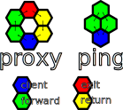

# Indranet Protocol White Paper

#### Onion routed distributed virtual private network protocol with anonymised payments to create scaling incentives.
> [David Vennik](mailto:david@cybriq.systems) September - December 2022

## Abstract

The state of counter-surveillance technologies has remained largely unchanged in
the 20 years since the inception of the [Tor network](https://torproject.org).

The primary use case has always been obscuring the location information of users
from clear net sites, and the more it has been used for this purpose, the more
hostile clear net sites have become towards this network, due to its frequent use
to launch attacks on web services.

With the increasing amounts of value being transported in data packets on the
Internet since the appearance of the Bitcoin network, the need for eliminating
the risks of geographical correlation between payments and user locations
continues to rise.

However, without any way for users to pay routers without creating an audit
trail, the anonymising networks have not grown in nearly a decade, and
thus well heeled attackers have largely been able to keep pace and pluck off
high value targets, such as
the [Carnegie Mellon University](https://blog.torproject.org/did-fbi-pay-university-attack-tor-users/) - implicated in part of what led
to the arrest of the Silk Road founder, Ross Ulbricht.

It is the central thesis of this paper to demonstrate how obfuscating
correlation between payments and session usage can be achieved and create a
marketplace in routing services which can economically increase to a size that
is beyond the capabilities of a state sized actor to fund an attack, while also
improving latency and stability of routed connections.

## Tor Isn't Scaling, But Bitcoin Needs Onion Routing

For comparison, this is Bitcoin's node count:

Versus Tor in a comparable period:

It is not hard to see:

- Tor is not growing, it has flat-lined.

- Bitcoin is growing.

Not only that, you can also see that onion routing is forming an increasingly
large component of Bitcoin connectivity.

## Why We Need Indranet

Three key elements of the Tor protocol make it less than desirable in general.

1. **High Latency** - Establishment of circuits is quite slow, taking a large number of steps
   to "telescope" into a circuit.

2. **Low Reliability** - Once a circuit is running, when it fails, the failure is opaque to the client
   side, and there is no way to provide a latency guarantee or connection
   stability. It is unsuitable for interactive and long living connections.

3. **Low Scaling Incentives** - There is no profit motive to drive expansion of relaying
   capacity, weakening anonymity by not expanding the anonymity set to cope with a rise in the number of users.

Tor is a poor solution for a very limited subset of of the use cases that
benefit from the security of route obfuscation. Indra aims to provide what Tor
has definitely now failed to achieve for a large majority of internet users:
location privacy.

Indranet does not aim to compete with Tor for the use case of tunneling out to clear-net websites and services: the focus is on obscuring the source of traffic within decentralised, peer to peer protocols like Bitcoin, Lightning Network, Bittorrent, IPFS, and other similar, decentralised protocols.

## General Principles of Indranet Protocol

There is four main types of traffic in Indranet:

1. **Network Protocol Chatter** - sharing lists of known network nodes, their advertised exit services, and collaboratively generated statistics on bandwidth and uptime, and their long lived public keys for session initiation.

2. **Purchase of bandwidth sessions** - Combining the use of Lightning Network to perform payments to proxy nodes, and specially formed layered encryption of messages, enabling clients to acquire tokens that grant users the ability to relay arbitrary traffic through relays.

3. **Liveness diagnostics** - In order to keep track of the state of relays on the network, clients send out regular 3 hop messages that circle back in a diamond-shaped topology that they use to acquire the liveness state of relays. This requires the relays to actually do work, so it costs a small amount, but provides reliable data about the state of relays the client has sessions with.

4. **Relaying messages to decentralised network services** - because all relays on Indranet, and even clients, must have a Lightning server and thus a full or light Bitcoin node, providing anonymised messaging to these protocols is the first type of exit traffic. Integration with other decentralised services will proceed later, and enable uploading or accessing content on networks like IPFS and Bittorrent, and eventually also to include decentralised messaging, social network, software/media repository hosting, and any other network, including federated and semi-decentralised systems like "cryptocurrencies".

## Protocol Concepts

### Packet and Message Encryption

Indranet uses a message encryption scheme based on [Elliptic Curve Diffie Hellman](https://en.wikipedia.org/wiki/Elliptic-curve_Diffie%E2%80%93Hellman) (ECDH) key exchange.

The message and packet headers contain the following elements:

- **Message checksum** - 4 bytes of the truncated hash of the remainder of the message or packet, for preventing tampering and ensuring integrity of the message.
- **Initialisation Vector** - cryptographically secure random value used for the payload encryption.
- **Cloaked public key** - generated via the use of a strongly random 3 byte value that is concatenated with the receiver's public key, and the first 5 bytes of the combined hash is concatenated to the 3 byte nonce value to prevent inferring association of a stream of message packets with each other. This key also acts as a session identifier, and for session traffic is the token returned from a session purchase.
- **Signature** - The hash of the payload data is signed with a private key that formed the other half of the ECDH enabling securely conveying the encryption secret to the intended receiver over an insecure network. These keys are generated using an algorithm that efficiently generates secure private keys that are correctly on the [secp256k1](https://en.bitcoin.it/wiki/Secp256k1) elliptic curve.

### Signing/Encryption Key Generation and Message Segmentation

The signatures on messages must be different for each subsequent message, and when a message exceeds 1382 bytes (based on a 1410 byte MTU, typical for mobile networks) the message will be segmented into pieces of this size, the last packet padded out with random based hash chain generated noise.

These signing keys are generated by creating two secure, secp256k1 private keys, the base and the secondary, and the base is scalar summed with the secondary to produce a new key, and this new key is then used again the same way for subsequent keys.

This scalar sum operation guarantees that the new private key is also a valid secp256k1 curve point (values not in the curve weaken the encryption), and can be performed very quickly without the resultant key being outside of the curve. Deriving the public key takes approximately the same time but a signature also maps to a message hash so it acts as a MAC (message authentication code) as well as providing half the encryption key to the receiver.

This scheme helps guarantee that once messages are encrypted, even if an attacker gains access to the network handler packet cache they cannot access the encrypted payload data.

### Onion Path Topology

In Indranet there are two primary types of messages, one having a hexagonal shape, the other being diamond shaped. Here is a visual representation with a legend indicating message types in each:

### Proxy

**Proxy** messages are the standard for messages where the **client** is sending messages through a proxy, called the **exit**. Each of the colours shown in the diagram represents the message type. 

- **Forward** messages are purely constructed by the **client**. They are to be carried forwards to a specified IP address, which will be the next hop in the path, or an **exit**, and use the **forward** key provided by relays on purchase. The next hop will decrypt the payload, which can contain either another **forward** or an **exit** message.
- **Return** messages consist of a preformed header encrypted to three secondary keys provided in the purchase process, called "return" keys, and three ciphers that are to be used sequentially to encrypt the reply message, and the cloaked address in a **return** relay message header layer combined with a public key the client generates to secure the message. The provided cipher for a layer uses the second key known to the relay and client but not the **exit** relay, thus they are unable to unwrap the encrypted message giving the address to the next hop, but by the header and a sentinel byte in the message the **return** hop node then switches to the secondary key that the **exit** doesn't know, that corresponds to the cloaked key, which generates the cipher the **exit** hop was given, combined with the public key visible in the first header. The second **return** hop also uses this alternate key in order to conceal to the relay whether it is first from the exit or second, the last header only has a packet identifier, because the cipher for the payload is cached by the sender alongside the identifier. This slightly elaborate scheme enables pure forward source routing with the only caveat that exits know they are exits, but **forward** and **return** don't know whether they are receiving from client, or first hop, and likewise return relays don't know whether they are receiving from an exit or sending to a client.
- **Exit** messages are a special type of message. The payload inside them is forwarded to an outside server, such as a Bitcoin or Lightning Network node, and when a reply is received, encrypted to a provided cipher, and is the payload in the reply, to be passed back via **return** messages.

### Ping

**Ping** messages are purely network probes, used to gauge the reliability of relays the **client** has sessions for. They are constructed out of 3 part onion layers, which ensures that they appear the same as the first two hops in a proxy message to any relay.

Clients perform **ping** messages periodically to check the state of nodes they might use, proactively, to derive several metrics to evaluate their use as hops in **proxy** onions.

### Client

Unlike Tor and other anonymising protocols, every client has the capacity to act as an **exit** for traffic while it is online, for at minimum, Bitcoin and Lightning Network messages. They advertise themselves as "unreliable" exit nodes, this descriptor indicating that they are intermittently offline, and do not attempt to stay online.

This increases the size of the anonymity set for these types of messages, and can include more exit protocols if the user is using them, such as IPFS and other decentralised protocols. It also makes it relatively simple for users to create small, low volume channels for Lightning Network, enabling direct, self-custodial LN payments.

In the diagram above, we distinguish the **client** with blue, but to the nodes before them in the circuit, they appear the same as the one sending, so, **forward** relays see a forward message to **client** and **exit**, and **return** relays see return, and **return** hops see **exit** as return.

All messages look the same as packets in transit, and have no common data between them to establish relationships other than timing. For this reason, the network dispatcher shuffles packets as it sends them out as well.

## Payment for Traffic

The foregoing descriptions of **forward**, **exit** and **return** messages assumed the existence of a **forward/return** routing key pair for each of the hops in the path. Before a client acquires these session keys, we have a chicken and egg bootstrap problem.

The resolution to this is inspired by the mechanism used by the [Sphinx](https://cypherpunks.ca/~iang/pubs/Sphinx_Oakland09.pdf) mix routing scheme, which uses "nymservers" to register anonymous identities with a small packet of arbitrary data.

Instead of nymservers, since it is possible to construct forward messages with only one public key advertised by each relay in the path, we can then send out a registration of a set of 3 ciphers connected to a public key, and this is sent to the intended seller, the relay that a client wants to acquire permission to route some amount of data through. These are encapsulated in an onion with two forward messages, the registration message payload, and two forward messages that actually just carry a token back to the client that informs them that most likely the relay they are trying to purchase from has received these ciphers.

Then the client sends a payment request message to the first hop for the amount required to perform the purchase, which includes a fee for each hop in the path, The purchase for bytes is randomised, so a little above or below the requested amount, plus the forwarding fees to the two hops that are required to reach the seller, there is no need for these in the return.

### Zero Fee Relaying

It's important to specify here also, that nodes do relay packets without associated sessions, but the processing is deprioritised. Relays have two buckets for traffic, one for paid and one for free. The free bucket contents are expired oldest first when the capacity is exceeded, and it is emptied in a ratio of something like 1 to 100 versus the paid bucket.

Thus, this is used for the forward only onion for providing a return cipher, as well as the two hops of return messages that carry a purchased session key pair back to the client. In other words, initial payments to establish accounts with relays can take several seconds, and in the bootstrap phase clients will carry out a number of purchase processes in parallel, and once sufficient sessions are acquired (4), subsequent purchases can be performed over partially paid forward and return paths. Once a node has 10 sessions acquired, it can buy new ones with only the new candidate relay subjecting the purchase to the free tier bucket.

## Relay to Relay Traffic

Messages are segmented into 1382 byte segments and reassembled by relays when they receive them. The relays return an acknowledgement being a signature on the hash of the packet data (which includes the checksum prefix), and these are dispatched in a stream after shuffling by the sending relay, as well as interleaving messages passing to the common next hop when this happens. 

The relay receives the batch of packets, and when it receives enough pieces to reassemble it, according to the error correction data in the packets, and succeeds, reads the message instructions and does as is requested, either a **forward** or **return** message, the difference being described previously. 

### Relay to Relay Encryption

In order to further secure traffic, relays in their chatter with each other provide private relay-to-relay keys to use for message encryption, which are rolled over at least once a day. 

### Dynamic error correction adjustment for Retransmit Avoidance

Based on the conditions of the paths between two relays, by the ratio of packet loss the nodes adjust the error correction to use in order to maintain a margin above the current loss rate, built using a moving average of successful deliveries versus failed.

## Client Path Generation Configuration

A flexible configuration system for selecting paths and exit points is required to cover several different types of use case of obfuscated traffic paths.

- Geo-location based exit and route hop selection:
	- Users may need to avoid using exits within their own or some specified outside jurisdiction.
	- Users may specifically want their exits to emerge in a specified geographical region.
	- Users may want to specify, or avoid selecting intermediate paths in a list of specified geographical regions.
- Selection of specific routers for exits for a given protocol:
	- Using a user's own servers, this can be generalised to allow remote access to a server controlled by the user.
	- A company may provide specific services that users can access at a given set of addresses, whether IP based or domain based.

## Rendezvous Routing for Hidden Services

In much the same way as for emerging directly at a selected router, rendezvous allows relay operators to provide services without revealing their location to the network. This functionality is fairly simple, it is a type of exit that requires the use of a specified public key used by the hidden service operator to negotiate routes to the rendezvous points, the router at the rendezvous essentially takes the packet received at the end point and instead of directly forwarding to another address, sends it in **return** messages to the hidden service's outbound rendezvous path.

This functionality is slated for later implementation after direct, at-router and forwarded connections are implemented, as it requires the design of a protocol for the hidden service to request relaying and wait for **return** messages as they arrive.

## Protocol Agnostic Transport

Indranet does not assume the type of traffic used by a given service. It simply relays messages. Indranet uses a specially designed protocol including a retransmit operation, acknowledgements, and the like, that operate over UDP, providing reliability with a combination of retransmit requests and proactive Forward Error Correction.

Thus, Indranet has both TCP and UDP listeners for clients and services, though it relays everything via UDP. The Socks5 proxy protocol scheme will also understand Indranet specific hidden service public key/address domains.

## Protocol Savvy Transport

In addition to providing standard TCP Socks5 based proxying and UDP proxying, Indranet will have a connection proxy protocol that exposes configuration for path finding according to the requests of the client. This will allow client-side control of connection parameters as mentioned in Client Path Generation Configuration at the application level.

This functionality will be built after Socks5 and UDP transports are built.

-----

# Fin
