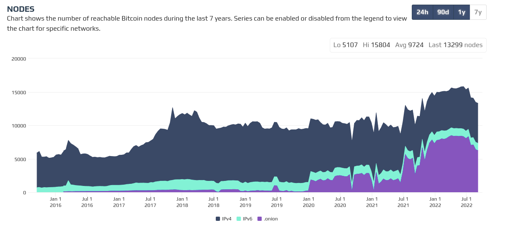

# Indranet White Paper

Programmable onion routing distributed virtual private network protocol with anonymised payments to create scaling incentives.

[David Vennik](mailto:david@cybriq.systems) September 2022

> Markdown format of this document is created with [Typora](https://typora.io)
> which renders the sequence and other graphs found in this document correctly.
> The PDF format may lag from the current state of the markdown document.

## Abstract

The state of counter-surveillance technologies has remained largely unchanged in
the 20 years since the inception of the [Tor network](https://torproject.org).
The primary use case has always been obscuring the location information of users
from clearnet sites, and the more it has been used for this purpose, the more
hostile clearnet sites have become towards this network, due to its frequent use
to launch attacks on web services.

With the increasing amounts of value being transported in data packets on the
Internet since the appearance of the Bitcoin network, the need for eliminating
the risks of geographical correlation between payments and user locations
continues to rise.

However, without any way for users to pay routers without creating an audit
trail, the networks have a severe scaling problem in that in anonymising data,
there is an increase in privacy with the larger number of nodes and users, and
thus attackers have largely been able to keep pace and pluck off high value
targets with state-sized players, such as the Carnegie Mellon
University: [blog.torproject.org/did-fbi-pay-university-attack-tor-users/](https://blog.torproject.org/did-fbi-pay-university-attack-tor-users/)
.

Thus, it is the central thesis of this paper to demonstrate how decorrelation
between payments and session usage can be achieved and create a marketplace in
routing services which can economically increase to a size that is beyond the
capabilities of a state sized actor to fund an attack.

Indra creates mechanisms for anonymous purchase of chaumian vouchers used to
initiate traffic sessions with router nodes, which then compensates routers for
their running costs, and further, focuses on hidden services and
Bitcoin/Lightning (and potentially other Bitcoin related systems) in order to
reduce the attack surface from large actors who have thus no open justification
for censoring the network.

## Tor isn't Scaling, but Bitcoin Needs Onion Routing

For comparison, this is Bitcoin's node count:



Versus Tor in a comparable period:


It is not hard to see: Tor is not growing, it's flatlined. Bitcoin is growing. Not only that, you can also see that onion routing is forming an increasingly large component of Bitcoin connectivity.

## Chaumian Routing Vouchers

Through the use of blinded signatures, it becomes possible for a token to be
created with some arbitrary data, usually a denomination of a currency, and the
buy and sell cannot be correlated to each other, the signature is valid, but it
cannot be directly linked with the minting.

However, in a distributed VPN, there is a need for fairly close correlation in
time between purchase and spend, which presents a problem for
counter-surveillance and eliminating traces connecting traffic timing, origins
and destinations.

Thus, the purchase of these vouchers is protected by a 6 stage onion route that
delivers Lightning transactions and returns vouchers in such a way that no
single participant in the process can know more than their adjacent nodes, and
not know, with exception of the voucher seller, what position they are within
the circuit.

These messages are constructed in layers by the client only. They include layered messages inside them for returning acknowledgements to confirm the completion of each stage of the process.

### Purchasing Protocol Flow

Thus, the purchases are made via an onion message and lightning network
payments, and each node passes on the decrypted message, which then provides the
payment destination for each subsequent hop, in a circle that goes through 5
nodes. 

The lightning payment goes first, and then the onion message contains this receipt in the header, as well as an acknowledgement packet that is returned to confirm forward payment. If a forward payment is not in fact done, the buyer knows because the following acknowledgement does not arrive, and thus the given node will be dropped to the bottom of the list for evaluating payment route candidates.

This is the top level view of the process:

```sequence
Alice->>Bob: purchase + 5 fees + filler
Alice->>Bob: 5 onions
Bob-->>Alice: acknowledge
Bob->>Carol: purchase + 4 fees + filler
Bob->>Carol: 4 onions
Carol-->>Bob: acknowledge
Bob-->>Alice: acknowledge
Carol->>Dave: purchase + 3 fees + filler
Carol->>Dave: 3 onions
Dave-->>Carol: acknowledge
Carol-->>Bob: acknowledge
Bob-->>Alice: acknowledge
note left of Dave: Issue voucher
note right of Dave: encrypt to given key
Dave->>Eve: voucher + 2 fees + filler
Dave->>Eve: 2 onions
Eve-->>Dave: acknowledge
Dave-->>Carol: acknowledge
Carol-->>Bob: acknowledge
Bob-->>Alice: acknowledge
Eve->>Frank: voucher + 2 fees + filler
Eve->>Frank: 1 onion
Frank-->>Eve: acknowledge
Eve-->>Dave: acknowledge
Dave-->>Carol: acknowledge
Carol-->>Bob: acknowledge
Bob-->>Alice: acknowledge
Alice-->>Bob: timeout trigger 
Bob-->>Carol: trigger revocation 
Carol-->>Dave: trigger revocation 
Dave-->>Eve: trigger revocation 
Eve-->>Frank: trigger revocation 
Frank->>Alice: send voucher + filler
```

At each stage, there is an onion packet that is supposed to be forwarded back as
acknowledgement. So for each subsequent hop the onion has one more layer, but
this is obscured with a uniform size matching the 5 maximum.

The timeout period for the process is fairly short, around 6 seconds, and if all
5 acknowledgements do not get received the buyer triggers the payment revocation
onions which reverse the payments for every hop that succeeded.

The payment revocations are carried in the forward packets but are locked by the
keys that are sent in the revocation onion packet. Once the node has the
revocation code they can cancel the forward payment on the channel and change it
to paying themselves.

### Onion Routing and Revocation

The scheme is similar to the "Sphinx" onion routed scheme. We are basing a large
part of this design on Blitz:

https://www.usenix.org/system/files/sec21fall-aumayr.pdf

Blitz has a one way flow and as it mentions deep in the appendix this can be
done using onion routing via Sphinx, to protect identity.

The revocations in plain Blitz include all the identities along the chain. The
key distinction here is that in the revocation packet each node gets, there is
encrypted to the previous node the revocation code, so in order to close the
loop they send the revocation back, and forward the revocation onion they have
after sanitizing their segment. In this way, the anonymity is preserved while
triggering the revocation forwards.

If a griefer or wormhole attacker causes the chain to break, the revocation
breaks the transactions going forwards that were honestly propagated. The entire
data structure is contained in the packet that is initially sent out by the
buyer, wrapped in layers of encryption. The only thing that has to be done is
if, based on the sender's measurement of the network topology and latency the
chain has probably been broken, is to send out the revocation onion message
which creates a revocation circuit that will then terminate at the attacker's
channel.

## Session Initiation

In order to open a session with a router, a client node has performed a purchase
operation where the desired router is the seller, and have a blinded signature
on a packet that encodes the claim while not identifying when or who made the
purchase by paying for it using the purchase protocol.

### Session Initiation Flow

Session initiation follows the same pattern as the purchase protocol. If the
acknowledgements fail within the forward payment timeouts, the fees are reversed
up to the node that sent the last acknowledge and if the last acknowledge is
from the router the client will then push the router's account to the bottom of
their priority list and not actively propagate their address.

```sequence
Alice->Bob: voucher + 4 fees + filler
Alice->>Bob: 5 onions
Bob-->>Alice: acknowledge
Bob->Carol: voucher + 3 fees + filler
Bob->>Carol: 4 onions
Carol-->>Bob: acknowledge
Bob-->>Alice: acknowledge
Carol->Dave: session key + 2 fees + filler
Carol->>Dave: 3 onions
Dave-->>Carol: acknowledge
Carol-->>Bob: acknowledge
Bob-->>Alice: acknowledge
note left of Dave: Issue session key
note right of Dave: encrypt to provided key
Dave->Eve: session key + 1 fees + filler
Dave->>Eve: 2 onions
Eve-->>Dave: acknowledge
Dave-->>Carol: acknowledge
Carol-->>Bob: acknowledge
Bob-->>Alice: acknowledge
Eve->Frank: session key + 1 fees + filler
Eve->>Frank: 1 onion
Frank-->>Eve: acknowledge
Eve-->>Dave: acknowledge
Dave-->>Carol: acknowledge
Carol-->>Bob: acknowledge
Bob-->>Alice: acknowledge
Alice-->>Bob: timeout trigger
Bob-->>Carol: trigger revocation
Carol-->>Dave: trigger revocation
Dave-->>Eve: trigger revocation
Eve-->>Frank: trigger revocation
Frank->Alice: session key + filler
```

### Preferring Long Lived Nodes

There is an attack potential in the creation of nodes that attract purchases and
then go offline before their services are delivered. For this reason, nodes will
prefer to buy vouchers from the longest lived routers and new routers will have
a longer lead time in acquiring regular work.

In addition, nodes will also propagate nodes to other nodes in order of their
first seen and best liveness averages. Liveness averages are the result of
cumulative ping and usage history which pushes a node's desirability rating down
exponentially, ensuring that a change in liveness has a strong time local
effect, whereas the recovery of desirability score is linear.

This functions as an eventual consensus for reducing the incidence of spending
on traffic and not receiving the service for it. Because the cost of sessions is
trivial and last a short time in most use cases the small number of nodes that
sell vouchers and then fail to deliver a session, it is enough that their
services are shunned, and their node not advertised as frequently by preferring
to advertise nodes with reliability and good uptime.

The reality of network service is always that one gets a tiny fraction less than
what is paid for no matter what, connections fail, systems crash, and sometimes they are malicious. Some cost always prevents full efficiency but this is the unavoidable consequence of entropy in all systems.

## Prices

Indra provides a set of tools for maintaining bandwidth prices, that allows the
accounting of their costs and maintains a margin of profit. Routers connection
properties are entered in, the billing cycles are configured, and based on these
cost inputs, and using exchange rate data, nodes then offer a given price which
is current until changed again.

Routers with a pay per byte scheme will usually have higher cost per byte than
nodes with pay per line capacity. In general the flat fee for line capacity is
the best arrangement for the network anyway, since very often pay per byte
services are higher latency mobile networks.

The clients have to pay these costs, so in the client they will see market
pricing charted against network latency to the nodes, and can pick a threshold
level where their routes will aim to target the price they are comfortable with.
There will be a trade off between anonymity set size for a given price point and
the smaller set (lower price) the greater the chance of route failure and the
latency disruption that brings with it.

When setting up a router, in the configuration a user can set the cost of
bandwidth based on the parameters of their internet service costs, and define a
margin. It can be the case that there is also bandwidth limitations, so this can
also be part of this setting. If a node is running low on its time limited
allocation (daily, monthly), it can raise the price of routing or simply cease
to sell vouchers until the period elapses.

Ultimately, the idea will be that many users will be providing router service in addition to consuming it. In this way, the fees charged for the various elements of the service amortize the usage costs, and preventing the free rider problem, which retards network scaling.

### Benefits to the Lightning Network

It should also be pointed out that implicitly, Indra routers are providing some
amount of Lightning Network channel capacity via their payment systems, and have
a somewhat automatic mechanism that can augment the Autopilot channel balancing
heuristics through bandwidth accounting. Nodes can set up broader channels than
strictly necessary for the routing purpose, and in doing so, create an extensive
increase in capacity and point to point connections.

The payment protocol naturally will result in easier balancing of channels, as
many payments are deliberately intermediated for protecting privacy, most of the time, flows in both directions will be about equal, thanks to probability.

Because the network naturally is highly liquid, in addition to providing
connectivity and capacity, the large number of transactions that run over the
channels in Indra network are thus also providing a greater resilience and more
paths, because the type of payment traffic they engage in is small and frequent,
this information can be used to help routers determine how to optimize payment
throughput of the network towards nodes with greater bandwidth.

Indra will effectively fatten the tail of Lightning Network channel distribution
by forming a very widely connected but low capacity paths, which coincides well
with the fact that micropayments are likely to be the most likely kind of
payment arrangement for pay per service of nodes running hidden services on
Indra. Thus, in addition to protecting user's location and associations between them, Indra will improve the micropayments use case for Lightning Network.

## Routing Patterns

In the Tor network there are two predefined routing patterns used, the three hop
to exit, and the 6 hop rendezvous path.

Indranet will use a modular, extensible onion packet construction, and exit
routing is not a priority, but rather to focus on hidden services and rendezvous
routing, and special types of exit paths that deliver messages to Bitcoin full
nodes and Lightning Network nodes.

Because all Indranet nodes must be running a Lightning node, and therefore a
Bitcoin node, these are valid exit networks that can be coded into the final
inner layer of the outbound route onion. Other peer to peer networks also could be offered, such as IPFS and Bittorrent, and ultimately, exit routing. See later for discussion of this and how it is monetised.

Because only the rendezvous paths are going to involve large quantities of data,
it will need to be possible to vary the routing pattern to provide different
properties to the traffic footprint.

### Reliability, Latency and Obfuscation

These three properties can be improved via the structure of the onion
construction.

#### Reliability

Reliability can be produced by expanding packets with Reed Solomon Forward Error
Correction (FEC), and sending these packets in parallel. Any balance of N of M
redundancy can be specified to the onion construction engine, most likely
patterns of 2, 3 and 4 parallel paths would be used.

Fan out/redundancy patterns need to be understood by the endpoint, also. Thus, in the implementation, endpoint nodes will require queues to aggregate multiple message paths and unpack the single packet inside them.

#### Latency

Latency can be improved by using parallel paths with two instead of three hops.
Instead of, or in addition to redundancy, packet data is split into segments
using Shamir's Secret Shares, and N of M must be received over a fan out/fan in
two hop path for each side of the Rendezvous. The reliability can be tuned in
parallel with this when packet drops occur.

Again, the endpoint of such a path must reconstruct the pieces from what packets it gets from the multiple intermediary routers. The pieces are collected and then when valid, forwarded onwards. The forwarding from endpoints is atomic by nature.

#### Obfuscation

In addition to these simple parallel path patterns, it is also possible to open
multiple sessions with a larger number of routers and vary the onion path in
each packet, in addition to also potentially using short path for latency, in a
way that further obscures the traffic's pathways.

#### Notes

These features may not be as useful as they sound in practice, but the means to
implement them should be available.

Note that parallel paths incur a proportional bandwidth cost, which should
reasonably match up with the benefit of lower latency, increased reliability or
higher security.

## Rendezvous, Forwarding and Inbound Routing

Because of the interference of routers and especially Network Address
Translation, it can be that a node may not be able to directly receive inbound
traffic. One of the big advantages of running a very large scale distributed VPN
is that there is usually many infrastructure nodes that can proxy inbound access
to nodes that cannot.

Peer to Peer network systems all have this difficulty of negotiating inbound
routing in order to provide services. Thus, there is always a need to enable
this proxying of inbound routing. There needs to be nodes on the network with routeable addresses,  and these nodes get the benefit of the extra traffic for service provision within the network.

Normally this is done simply through Rendezvous routing, for hidden services,
but because this inbound routing issue can be a problem, the programmability of
the routing paths in the previous section also means it can be simple for nodes
to create "open" rendezvous points that do not attempt to hide the location of
the server. This still results in traffic on the network that adds the anonymity
set for the anonymising services, and can be charged for the same way. There is a definite extra cost in enabling inbound routing, and this thus rationalises the extra earning capability for these nodes.

The user pays, and the user's client software can be programmed to perform the
routing as requested. Thus, where normally a rendezvous is a 3 hop circuit, it
can be 2 or 1, and effectively simply be forwarding, like a reverse proxy. The
cost of each hop is a factor and thus if traceability is not a concern for the
service (for example, its services are relatively low value) it can simply
directly advertise rendezvous points of one hop and save on routing fees, and
still increase the anonymity set of the network, and work around a lack of
available inbound routing for the endpoint.

### Advertising Rates for Network Exit

As part of the peer to peer node advertising system, nodes also list available
services that exit on their router. Normally by default this will be lightning
and bitcoin nodes, but it can be anything at all. Tunneling out to clearnet can
be available too. In addition to the name of service, and port number related to
it, a price per byte on this traffic can also be levied.

This fee is managed in
the same way as simple internal network routing services, the buyer will want to
use an onion route to purchase it if they are going to onion route to the exit
as well. But again, one could skip the onion route for the payment, and go
direct to the exit, and save on routing fees while adding to overall network
traffic and the anonymity set.

Making the route construction modular, and enabling potentially arbitrary paths, and charging for this with potentially anonymised payments, means that the bigger picture for Indra is that ultimately it can become in band payment layer for ALL internet traffic, *in potentia.*

## Creating Circuits

In most descriptions of Onion Routing protocols, it is usual to discuss the
circuit creation protocol. The foregoing sections describe the Purchase and
Session Initiation protocols which form a shared secret which allows the fast
establishment of circuits. The voucher is an "out of band" secret so it
participates in the session initiation, allowing a reduction of steps in circuit
building.

The process of establishment of an onion routed path usually requires the
creation of an secret key value that can be used to establish an initial cipher
set for the onion path. Because these blinded signature Chaumian Vouchers are
private between the client and router, these form a base to establish the send
and receive keys used as well as establishing a bandwidth tracking protocol to
enforce a session protocol.

Sessions then can be tracked by the use of a hash chain on each side of the
routing protocol, so each subsequent packet must be the hash of the previous
hash rooted in the original session key based on the blinded signature based
voucher.

Thus, in Indra, there is no circuit building process. The session initiation
creates the necessary shared secret and after this any packet arriving at the
relevant router encrypted to this key and bearing the session progress hash
chain will be processed and subtract remaining bandwidth.

The reason why is that the session initiation takes place using the same cycle
as the purchase, which obscures buyer and seller from each other, and because
the traffic is authorized by having been paid for, there is no further
negotiation required, in the Tor protocol each circuit must be built in a
multi-step process. The hash chain position and the expected return path are
defined by the client and agreed in the formation of the session initiation.

This is important because not requiring this initiation process for a period of
time allows dynamic path changing when hops in the path break, enabling a much
faster recovery than in the Tor protocol.

## Session Encryption

In order to reduce the potential for capturing encryption keys, all sessions, on
each onion layer, use
the [Double Ratchet](https://signal.org/docs/specifications/doubleratchet/) key
negotiation algorithm. This key change will be triggered by the sender at a rate
of around once per 4 seconds, to reasonably bound re-keying overhead. This will
mean on average 1 key change per second per onion layer for exit paths and a
little more for circular paths.

The individual message segments, composed of one or several sequential UDP
packets, will be identifiable by a hash chain sequence which is used by the
nodes and clients to keep an account of the bandwidth remaining in a session.

In order to enable all this, there is a difference in the signaling patterns in Indra. That is, all traffic must be prompted. All return packets come via codes delivered in an initial request packet outbound. This guarantees a very noisy pattern to routing data that does not easily correlate to data volume, and most especially not to endpoints of the paths, unless they exit, and the exit protocol is immediate. Exiting messages to Bitcoin and Lightning don't have immediate and direct outbound signals, they are mediated by validation steps and their outbound direction is random depending on the state of nodes' current peers.

## Routing

Since other than Bitcoin and Lightning networks, Indra does not provide, by
protocol, in its core implementation, exit nodes to tunnel out of the network, the third and equally
important endpoint for a 3 hop circuit is a rendezvous.

On each side of the rendezvous, the client and the server create a 6 step
circuit, not reusing the intermediary, so involving 5 other nodes, the middle
point being the rendezvous, in a similar topology as the voucher purchase and
session initiation.

The topology of the onion is the same as the Voucher Purchase and Session
Initiation, except each layer only contains a session hash chain sequence, the
onion route, a time to live, and the payload.

```sequence
note right of Alice: sender
Alice->Bob: 1
Bob-->Alice: fail
Bob->Carol: 2
Carol-->Bob: fail
Bob-->Alice: fail
Carol->Dave: 3
note left of Dave: listener
Dave-->Carol: fail	
Carol-->Bob: fail
Bob-->Alice: fail
note right of Dave: sender
Dave->Eve: 4
Eve-->Dave: fail
Dave-->Carol: fail	
Carol-->Bob: fail
Bob-->Alice: fail
Eve->Frank: 5
Frank-->Eve: fail
Eve-->Dave: fail
Dave-->Carol: fail	
Carol-->Bob: fail
Bob-->Alice: fail
Frank->Alice: 6
note left of Alice: listener
```

The last 3 layers of the onion only provide the directions, but are encrypted to
the sender's key, with the pre-negotiated hash chain sequence header and
symmetric key for the next hop, concealing whether the packet is outbound or
inbound, as their format is the same.

On the other side for the hidden service, the same pattern is provided, and
circuits complete when one side sends and then the other side completes its half
way journey, and vice versa.

### Failure modes

Note the "fail" paths - these are messages that propagate backwards if the before the configured TTL
the sender does not get an acknowledgement from the next step in the path. These allow the
customisation for the type of traffic, for interactive versus bulk transfer. They enable only when timeouts are triggered, in order to diagnose the failure point in the path causing a transmit/receive failure.

If the failure return cascades are triggered, it means a node in the circuit is
either offline or congested, and the onion routing will be reconfigured with a
different node in the failure point, which returns as the hash chain counter
value, which identifies the node that failed to relay within the time limit.

It is an extra cost in data overhead to encode the failure onions so they back
propagate, but this small reduction of bandwidth is compensated by the way that
with this information clients can construct a new path rapidly thanks to the
pre-initiation of sessions in the purchase/initiate steps.

### Client side path creation and benefits of gossip pattern

In order to enable this dynamic path changing, this network has a constant
chatter. For every message that is desired to return to the client, there must
be an onion constructed to shepherd the payload back from the rendezvous point
or exit. Thus a ping will come with an onion that routes the pong back to the
client, for example.

There is only a fixed size to the packets, so in order to perform a receive of
data, the client must continuously send requests for more. There is no passive
routing here because this would break the security of the paths provided by the
Double Ratchet key negotiation. In the Tor protocol, these return paths are only
created in the circuit extension stage, but in Indra every forward packet
contains the round trip path to enable dynamic changes in paths and route around
congestion and offline failures.

Obviously this incurs a substantial cost in AES encryption for the onion layers,
and forces a constant signaling pattern, but this improves the anonymity set
anyway. The volume/structure of onion circuit construction has a signature in
the traffic, which Indra works around by separating the voucher purchase and
session initiation, which means that large scale surveillance operators do not
have very much useful timing data as packets are largely uniform in size and
constant frequency. This also dictates that the maximum payload size an onion
can carry is limited, in order to ensure there is a uniform packet size and
frequency, removing timing data of what is carried by the onions.

Shorter routes can be programmed by users if their need for privacy of a signal is not high. Standard 3 hop paths implicitly are 3 times as expensive to use as single hops.

Note that return circuits the endpoint is provided the encryption keys for the
three hops back, but these keys are built from the secret knowledge of the
client from the session double ratchet, and change with every new message *cycle*. Thus
they give no information to the endpoint about the path back to the client. The ratchet is not actuated every message, but periodically, with a data or time limit configured. The ratcheting is a separate message type to the out/inbound data delivery.

## Anonymity is not everything

In addition to creating rendezvous paths of arbitrary structure to rendezvous
points, there can be "clear" exit points, which essentially amount to connecting
to servers running on the same node as the router. This is by default lightning
and bitcoind, but could feasibly be anything, the security isolation would be a
factor of the protocol's structure and sensitivity and value of the data it
handles. In simple terms, it is like port forwarding on NAT.

### Wireless Hot Spot Routing

A second use case that is not related is providing internet service through an "
open" hotspot. The hotspot would refuse to relay normally, but has an Indra
listener which can be negotiated with to send vouchers or LN payments and then
becomes a usable access point. This ends the conflict between open hotspots and
abusive users, as all users have to then pay for bandwidth, at minimum, as for
one hop in a chain of the Indra network.

Where you can go from there, depends on the policy of the router, which will
generally mean you are inside Indra using LN, Bitcoin or Indra messaging.
Because the router is running LN and Bitcoin, it can freely provide sync data
for the chain and for the user's channels, and thus combined with Neutrino,
enables ubiquitous full SPV nodes on mobile devices. Users running these
hotspots can also alternatively levy a higher charge for clearnet exiting, but
as a general default, the purpose of this network is to enable access to hidden
services, not tunneling. Hidden service access costs are lower because the
endpoint cannot correlate to the entry point, and thus do not potentially
present a security liability for the node operators.

Owners of such networks will then have special owner keys which let them send
traffic on their own nodes without paying, and this service can then be exposed
on unsecured wireless access points and become a direct source of income for the
owner when others use it, while remaining secure by only carrying in-band
traffic destined for other onion routers lightning/bitcoin and hidden services.

### Benefits for Other Peer to Peer Protocols: IPFS, Bittorrent

This also can ultimately facilitate more security for IPFS and Bittorrent
networks as well, because everything adds to the anonymity set, if it is tuned
to work with it well. One of the big problems with Tor is it is tuned to the
TCP/HTTP use case and this is only part of network traffic usages. So
additionally to LN/Bitcoin there can be specific "exits" for IPFS and Bittorrent
ports.

Thus, as a later stage of implementation, these features should be included, and
to enable it, an extensible proxy/socket protocol needs to be devised, built for
the smallest use case set, and designed to be extensible for these several
cases.

It is however of importance because when appliances are built to provide this
routing service, they can have optional wireless interfaces that can run open
hotspots that provide free seeding (with bandwidth limits) of locally available
Bitcoin block data and mempool, and facilitate opening Lightning channels to
enable payments.

### Enabling Mobile `neutrino/lnd`

This would mean devices with installed mobile clients, running Neutrino SPV
nodes and on-net and Lightning wallet functions will always be able to connect
and make payments anywhere a router is installed. This takes the burden of
having internet connectivity away from the users, which can be very helpful for
payment use case in that access to the payment network is free - and it is
essentially quite a low cost additional to running the node, and the protocol
compensates the users in accordance with their prescribed fee rates.

## Circuit Parameters

When creating connections, different types of traffic have different
requirements for reliability and latency. As such, based on standard TCP Type of
Service flags, circuits can be set to have constant acknowledgement cycling or
only turn on acknowledgement seeking after a given timeout.

Conventional TCP services have a set of assumptions that don't hold well in the
face of forward privacy onion circuit design. Thus, there are parameters that
are used for Indra circuits:

- timeout - how long to wait for message return before retry.
- dead circuit retries - how many failed returns to count as triggering defining
  a circuit as dead, and start probing with acknowledgement back propagation
  onions to determine the router that is unresponsive, essentially a trigger
  that limits how long the connection stalls before probing the path. This then
  allows replacing the dead router with a working one in the circuit for a
  connection.
- latency guarantee - to do this, each hop will back propagate an onion that
  carries a packet acknowledgement. These decrease circuit bandwidth by
  consuming more of the fixed size packet, but prevent long delays from routers
  in the path failing, thus raising the effective cost of bandwidth.

