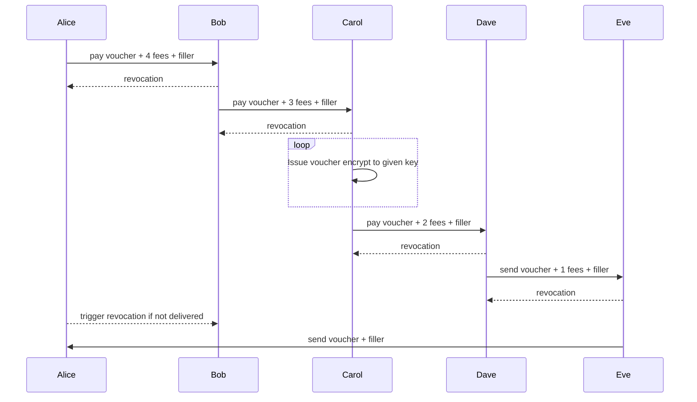
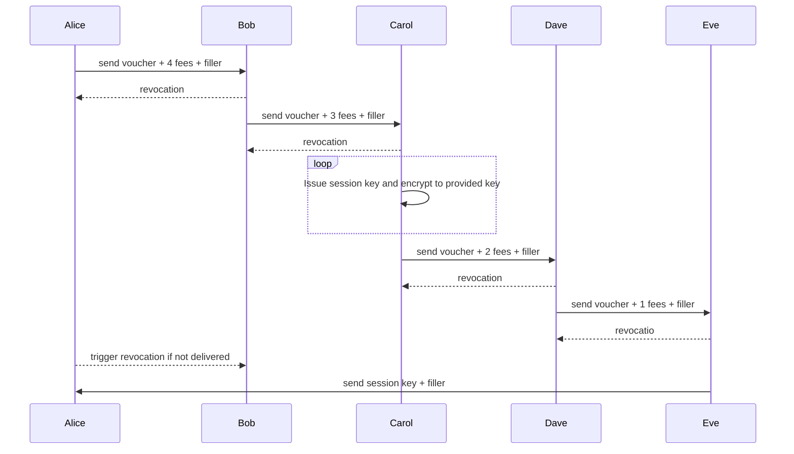

# Indranet White Paper

###### Programmable onion routing distributed virtual private network protocol with anonymised payments to create scaling incentives

[David Vennik](mailto:david@cybriq.systems) September 2022

## Abstract

The current state of counter-surveillance technologies has remained largely unchanged in the 20 years since the inception of the [Tor network](https://torproject.org). The primary use case has always been obscuring the location information of users from clearnet sites, and the more it has been used for this purpose, the more hostile clearnet sites have become towards this network, due to its frequent use to launch attacks on web services.

With the increasing amounts of value being transported in data packets on the Internet since the appearance of the Bitcoin network, the need for eliminating the risks of geographical correlation between payments and user locations continues to rise.

However, without any way for users to pay routers without creating an audit trail, the networks have a severe scaling problem in that in anonymising data, there is an increase in privacy with the larger number of nodes and users, and thus attackers have largely been able to keep pace and pluck off high value targets with state-sized players, such as the Carnegie Mellon University: [blog.torproject.org/did-fbi-pay-university-attack-tor-users/](https://blog.torproject.org/did-fbi-pay-university-attack-tor-users/). 

Thus, it is the central thesis of this paper to demonstrate how decorrelation between payments and session usage can be achieved and create a marketplace in routing services which can economically increase to a size that is beyond the capabilities of a state sized actor to fund an attack.

Indra creates mechanisms for anonymous purchase of chaumian vouchers used to initiate traffic sessions with router nodes, which then compensates routers for their running costs, and further, focuses on hidden services and Bitcoin/Lightning (and potentially other Bitcoin related systems) in order to reduce the attack surface from large actors who have thus no open justification for censoring the network.

## 1. Chaumian Routing Vouchers

Through the use of blinded signatures, it becomes possible for a token to be created with some arbitrary data, usually a denomination of a currency, and the buy and sell cannot be correlated to each other, the signature is valid, but it cannot be directly linked with the minting.

However, in a distributed VPN, there is a need for fairly close correlation in time between purchase and spend, which presents a problem for counter-surveillance and eliminating traces connecting traffic timing, origins and destinations.

Thus, the purchase of these vouchers is protected by a 6 stage onion route that delivers Lightning transactions and returns vouchers in such a way that no single participant in the process can know more than their adjacent nodes, and not know, with exception of the voucher seller, what position they are within the circuit.

### Purchasing Protocol Flow

Thus, the purchases are made via payments, and each node passes on the decrypted message, which then provides the payment destination for each subsequent hop, in a circle that goes through 5 nodes. This is the top level view of the process:

Each fee is different by 1, for example: 5, 6, 7, 8, 9, enabling a check by the remainder at the last step of the route

Filler is required to eliminate any leak of information about a node's stage in the process. Seller obviously will know they are 4th but they only know their previous and next.

Revocation for each hop in the loop is an onion message that is encrypted to the previous sender, which unlocks the reversion transaction. If Alice doesn't get her voucher from Frank, before the period of the timeout, she can send the revocation key to Bob and Bob sends on through the other 5 and the channel state is reverted.

It is critical that no single entity in this chain knows any more than the origin of the message and the next place it is to go. So the construction of the message goes in the reverse order. In order to incentivise this process each step has a small fee, likely in the order of tens of satoshis.

1. Message to Frank, send packet to Alice plus fee
2. Message to Eve, send packet to Frank plus fee
3. Message to Dave, issue voucher and encrypt to provided key, remainder to fees
4. Message to Carol, pay forward to Dave minus fee
5. Message to Bob, pay forward to Carol minus fee

The message segments are randomly positioned in the payload and obscure the sequence point of each participant's message in the process, coin flip between append or prepend for each layer, and the next message segment is padded with random values so each hop has an identical sized message with a section they decrypt and the remainder with the next hop message.

In this way, a user pays for a voucher, and receives it without there being a direct trace either in the message forwarding or the ordering of lightning payments. The base of the fee size is a random amount excess, between 2 and 3 times and at the end part of Alice's original forward payment goes back, eliminating any correlation between fee size and protocol sequence.

### Onion Routing and Revocation

The scheme is similar to the "Sphinx" onion routed scheme. We are basing a large part of this design on Blitz:

https://www.usenix.org/system/files/sec21fall-aumayr.pdf

Blitz has a one way flow and as it mentions deep in the appendix this can be done using onion routing, to protect identity.

The revocations in plain Blitz include all the identities along the chain. The key distinction here is that in the revocation packet each node gets, there is encrypted to the previous node the revocation code, so in order to close the loop they send the revocation back, and forward the revocation onion they have after sanitizing their segment. In this way, the anonymity is preserved while triggering the revocation forwards.

If a griefer or wormhole attacker causes the chain to break, the revocation breaks the transactions going forwards that were honestly propagated. The entire data structure is contained in the packet that is initially sent out by the buyer, wrapped in layers of encryption. The only thing that has to be done is if, based on the sender's measurement of the network topology and latency the chain has probably been broken, is to send out the revocation onion message which creates a revocation circuit that will then terminate at the attacker's channel.

Because the reverse transaction will have a total amounting to the extent the chain propagated until it stopped, the sender also is then able to determine the node which broke the chain, and with current data on the status of the node appearing to be online, determine whether it is a transient network failure or a malicious node, and if malicious, then it is simple to then push this node to the bottom of the list of options with a record of their mischief.

### Spending Vouchers Flow

Once a user has acquired these vouchers, they can then use them in their onion routing packets to initiate sessions and spend the tokens.

The issuers receive special expiring payments that time out in case of the node going offline. When they receive the chaumian voucher, it contains the revocation key to stop the payment expiry and finalize it, which they can then apply at any point until the LN payment's expiry. Typical expiry would be something of the order of one day.

They send back the session cookie, a 256 bit value, encrypted to a provided key, using a rendezvous routing packet, and after this, the user then attaches this to every packet in the relevant node's layer of the onion and the node will continue to forward them to the specified destinations until the session count of packets is used up.

## 2. Routing Patterns

In the Tor network there are two predefined routing patterns used, the three hop to exit, and the 6 hop rendezvous path.

Indranet will use a modular, extensible onion packet construction, and exit routing is not a priority, but rather to focus on hidden services and rendezvous routing, and special types of exit paths that deliver messages to Bitcoin full nodes and Lightning Network nodes.

Because all Indranet nodes must be running a Lightning node, and therefore a Bitcoin node, these are valid exit networks that can be coded into the final inner layer of the outbound route onion. Potentially in later iterations a clearnet exit method may be added, but the liability and risk imposed on exit nodes means that this will be a premium priced service, and outside of the scope of the first generation of Indranet.

Because only the rendezvous paths are going to involve large quantities of data, it will need to be possible to vary the routing pattern to provide different properties to the traffic footprint.

### Reliability, Latency and Obfuscation

These three properties can be improved via the structure of the onion construction.

#### Reliability

Reliability can be produced by expanding packets with Reed Solomon Forward Error Correction (FEC), and sending these packets in parallel. Any balance of N of M redundancy can be specified to the onion construction engine, most likely patterns of 2, 3 and 4 parallel paths would be used.

#### Latency

Latency can be improved by using parallel paths with two instead of three hops. Instead of, or in addition to redundancy, packet data is split into segments using Shamir's Secret Shares, and N of M must be received over a fan out/fan in two hop path for each side of the Rendezvous. The reliability can be tuned in parallel with this when packet drops occur.

#### Obfuscation

In addition to these simple parallel path patterns, it is also possible to open multiple sessions with a larger number of routers and vary the onion path in each packet, in addition to also potentially using short path for latency, in a way that further obscures the traffic's pathways.

These features may not be as useful as they sound in practice, but the means to implement them should be available.

## 3. Rendezvous, Forwarding and Inbound Routing

Because of the interference of routers and especially Network Address Translation, it can be that a node may not be able to directly receive inbound traffic. One of the big advantages of running a very large scale distributed VPN is that there is usually many infrastructure nodes that can proxy inbound access to nodes that cannot.

Peer to Peer network systems all have this difficulty of negotiating inbound routing in order to provide services. Thus, there is always a need to enable this proxying of inbound routing.

Normally this is done simply through Rendezvous routing, for hidden services, but because this inbound routing issue can be a problem, the programmability of the routing paths in the previous section also means it can be simple for nodes to create "open" rendezvous points that do not attempt to hide the location of the server. This still results in traffic on the network that adds the anonymity set for the anonymising services, and can be charged for the same way.

## Sessions

In order to open a session with a router, a client node has performed a purchase operation where the desired router is the seller, and have a blinded signature on a packet that encodes the claim to settle the open payment transaction that the purchase creates.

Session initiation follows the same pattern as the purchase protocol, except instead of a forward payment for the voucher, the voucher is sent forward and there is only 5 hops:

The failure mode here would require accounting the failure against the node and their voucher. A node would have to put the entry to the bottom of the list, as there can be a simple offline failure here, which may resolve in a period of time.

It is not practical to account for this situation, as the payment was made anonymously and a cancellation would necessarily require a repeat of the purchase process but for refund, and for the non-use case, is a trivial fee for one block of traffic and thus, there is no expiry, only the small risk that the router is offline and their voucher can be retried later, and eventually expired if storage requirements dictate.

The worst case scenario here is a user may have to wait a few seconds to purchase a few sessions if they have run short, and lose a few parts of sessions or vouchers if the node goes offline.

There is an attack potential in the creation of nodes that attract purchases and then go offline before their services are delivered. For this reason, nodes will prefer to buy vouchers from the longest lived routers and new routers will have a longer lead time in acquiring regular work.