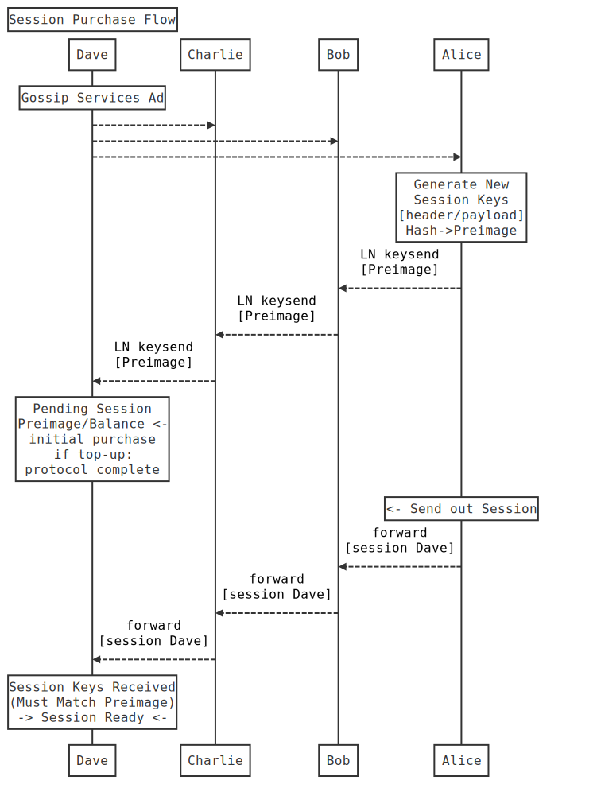
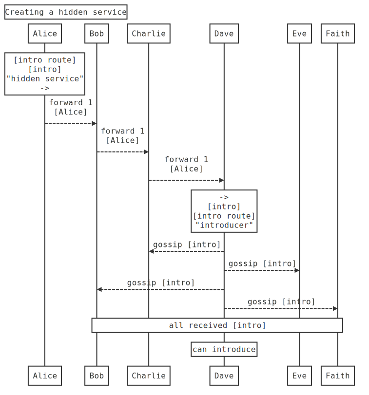
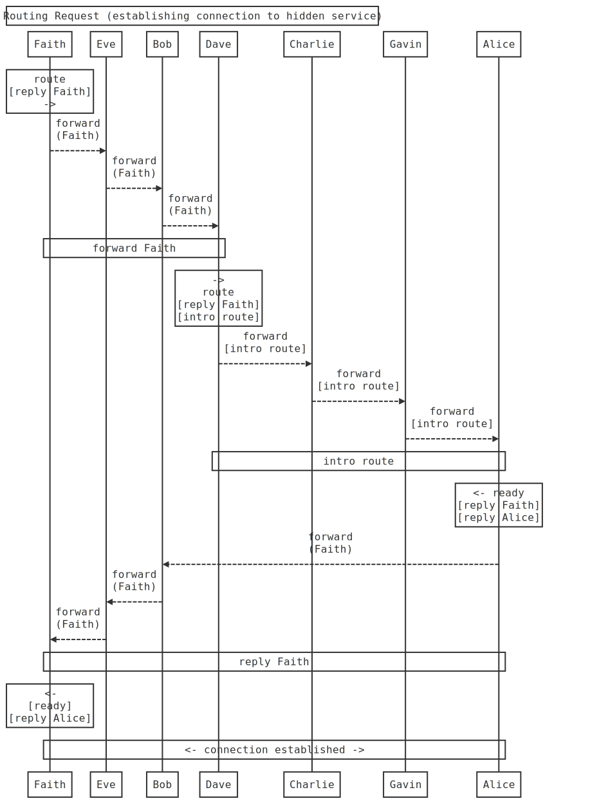
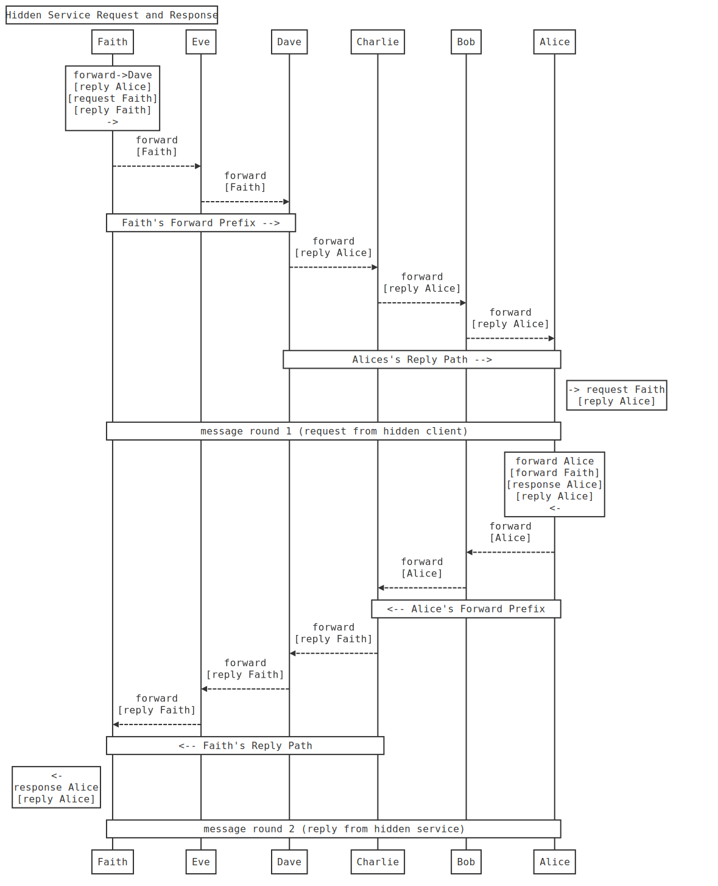

# protocols

## Public Services (Layer 1)

#### Client Side Location Confidentiality

### 1. Session Initiation Protocol

Forming the first layer of the Indra protocol is the simple parts of peer to peer communication and the construction of routing paths from gossiped network peer metadata, and the provision of the primary clearnet service, the `Exit`. An exit is basically a proxying request, and just as simple forwarding has a fee rate, exit services, called `Services` are charged at different rates, and on both relay and client side the accounting is done independently and in case of transmit failure or a long time offline clients can also query balances.

The primary facility given by the `Exit` is client side anonymity. The relays cannot directly determine from where the requests originate. Since this would otherwise be a spam magnet, none of these requests are fulfilled without the client first establishing session. Thus, the first protocol to discuss is the first step, paying for and confirming a session.



```sequence
Title: Session Purchase Flow
Note over Dave: Gossip Services Ad
Dave-->Charlie: 
Dave-->Bob:
Dave-->Alice: 
Note over Alice: Generate New\nSession Keys\n[header/payload]\nHash->Preimage
Alice-->Bob: LN keysend\n[Preimage]
Bob-->Charlie: LN keysend\n[Preimage]
Charlie-->Dave: LN keysend\n[Preimage]
Note over Dave: Pending Session\nPreimage/Balance <-\ninitial purchase\nif top-up:\nprotocol complete
Note over Alice: <- Send out Session
Alice-->Bob: forward\n[session Dave]
Bob-->Charlie: forward\n[session Dave]
Charlie-->Dave: forward\n[session Dave]
Note over Dave: Session Keys Received\n(Must Match Preimage)\n-> Session Ready <-

```

At this point, Alice now can send forwarding and exit messages to Dave until they consume the balance of milliSats remaining on the session.

Note that generally nodes create 5 separate sessions per relay, not all at once, but they are easily strung together as a forward message to send out to any number of relays one has paid for sessions with, to provide the matching keys that are concatenated and hashed to generate the Preimage.

Also, it is currently idiom in the protocol implementation to count the position in a 5 hop round trip to isolate sessions to their given hop position when purchased. The first and last hops see the client's IP address, so it would leak information for the client to ever use these sessions that associate to their identity as a peer for other hops in the path.

### Exits

#### Tunnels out of Indra

The tunnels out of the Indranet are called "Services". These are essentially anything whatsoever, but are confined to a 16 bit well known port to designate the protocol involved. This also includes Indra itself, which allows what we are calling "Path Punching", which is looping out of Indra and back into Indra. So as a default all nodes provide an exit path to act as a client of the relay.

This provides flexibility for client applications that may want to construct more complex paths while masquerading as relay traffic yet being exit traffic. Of course client applications could instead generate nonstandard length onions, for whatever reason. In the Lightning Network these long paths are based on the state channel availability, whereas with Indra it is network connectivity and thus all paths are available to use.

As has been discussed at great length in many writers words about the Tor network, the combinatorial mathematics of cloaking paths has a rapid loss of latency in exchange for a marginal increase in anonymity. Generally detection avoidance strategies on mixnets is best done by adding latency, or proliferating decoy traffic.

Decoy traffic will be discussed in later sections as there will be a reciprocal protocol for peers to perform decoy traffic. These decoys will require some method of checking the peer is in fact reciprocating, which will be visible in their peer to peer decoy sessions with each other. For the most part, having coincident timing and traffic volume emanating from a relay halves the chances of the right path being followed and thus reduces by a factor of 8 after 3 hops with decoying. Decoying is critical to enabling a low latency mixnet. Timing attacks get easier the lower the latency of the communication cycles.

```sequence
Title: Exit Protocol
Alice-->Bob: insert thing here
```


# Private Services (Layer 2)

#### Server Side Location Confidentiality

Indra's default mode of operation is providing client side anonymity, for which the source routing model is very suited. But sometimes the service needs to also be private, and for this, further protocols are required to advertise the services without revealing the host. For reasons of logic and easier understanding, these are grouped under Layer 2, where the primitives and simplest client-side anonymity protocols are Layer 1.

### 1. Creating a hidden service

In this phase, Alice, who wants to receive inbound connections via a hidden service, sends out an introduction request to Dave, who will serve as introducer, via a 3 hop forward path.

As introducer, Dave will now gossip the `intro` over the gossip network (Kademlia DHT Pub/Sub), and everyone will have this intro or be able to query neighbours in case they didn't receive it.



```sequence
Title: Creating a hidden service
Note over Alice: "hidden service"\nforward Alice\n[intro route]\n[intro Alice]\n->
Alice-->Bob: forward\n[Alice]
Bob-->Charlie: forward\n[Alice]
Charlie-->Dave: forward\n[Alice]
note over Alice,Dave: forward Alice ->
note over Dave: ->\n[intro Alice]\n[intro route Alice]\n"introducer"
note over Alice,Faith: <- Dave gossip [intro Alice] ->
```
At this point Bob, Charlie and Eve now know about Alice's hidden service 

### 2. Requesting connection from Introducer (Routing Request)

Faith has acquired an `intro` by some means and wishes to establish a connection to the hidden service. 

She forwards a route request, with an attached reply header to route a reply back to her, to Dave, the introducer for this illustration.

Dave then wraps up the route request and reply messages in the `intro route` it received along with the `intro`, which is used to forward one (1) request back to the hidden service.

> !!!! Here it might be good to mention that there is a flood attack vector here with creating unlimited numbers of `intro route`/`intro` over the gossip network. This, and the current lack of accounting for traffic to hidden services are both intertwined elements that fix this vulnerability. Nodes simply will require a high fee to accept an introduction, big enough that the spam use case is linearly more expensive than honest use.
>
> For the MVP this functionality will not be implemented, but we are already aware of it and will complete this after MVP.
>
> Also note there is no risk here of these 3 `intro route` packages being an avenue to unmasking, though in the request/response cycle this requires two forwards from the sender to ensure the receiver is not trying to unmask the client.

Alice then will receive the route request, with Faith's reply packet. Alice places her forward prefix, in case Faith also controls the first hop and thus would unmask Alice. This prefix is required in all messages in addition to the 3 hop reply in order to prevent either party unmasking each other.

This is not required for the first two steps of this part of the protocol because everyone knows the introducer, and neither client nor server would gain anything by controlling the adjacent hops on Dave's end of the path (last inbound, first outbound). But an attacker would want to attempt to unmask Alice, or a malicious hidden service would try to unmask Faith, and both cases are covered by each side adding their own two hops prior to the provided reply path.



```sequence
Title: Routing Request (establishing connection to hidden service)
Note over Faith: forward->Dave\n[route request Alice]\n[reply Faith]
Faith-->Eve: forward\n[Faith]
Eve-->Bob: forward\n[Faith]
Bob-->Dave: forward\n[Faith]
Note over Faith,Dave: forward->Dave
note over Dave: -> intro route Alice\n[route request Alice]\n[reply Faith]
Dave-->Charlie: intro route\n[Alice]
Charlie-->Gavin: intro route\n[Alice]
Gavin-->Alice: intro route\n[Alice]
Note over Dave,Alice: intro route Alice ->
Note over Faith,Alice: intro route Alice via Dave ->
note right of Alice: -> route request Alice\n[reply Faith]
note over Alice: forward Alice\n[Faith<-reply]\n[ready]\n[reply Alice]
Alice-->Charlie: forward\n[Alice]
Charlie-->Dave: forward\n[Alice]
note over Alice,Dave: <- prefix Alice
Dave-->Bob: forward\n[Faith]
Bob-->Eve: forward\n[Faith]
Eve-->Faith: forward\n[Faith]
note over Dave, Faith: <- forward path Faith
note over Faith,Alice: <- ready reply Alice to Faith
note over Faith: <-\nready\n[reply Alice]
Faith -> Alice: connection established
Alice -> Faith:
```

### 3. Request/Response Cycle

Once the receiver has the 'ready' signal, it can then begin a process of request and response wherein each reply carries the reply route header for the return path.

If a message fails the the parties keep past keys to decrypt latent messages or if it appears the outbound message may have got lost to retry a message using an older key since the key change message may have failed to get across before it arrived in the receiver's buffer.

Engineering more reliability into this requires the use of split/join message layers and layer two error correction compositions.



```sequence
Title: Hidden Service Request and Response
Note over Faith: forward->Dave\n[reply Alice]\n[request Faith]\n[reply Faith]\n->
Faith-->Eve: forward\n[Faith]
Eve-->Dave: forward\n[Faith]
Note over Faith,Dave: Faith's Forward Prefix -->
Dave-->Charlie: forward\n[reply Alice]
Charlie-->Bob: forward\n[reply Alice]
Bob-->Alice: forward\n[reply Alice]
Note over Dave,Alice: Alices's Reply Path -->
Note right of Alice: -> request Faith\n[reply Alice]
Note Over Faith,Alice: message round 1 (request from hidden client)
Note over Alice: forward Alice\n[forward Faith]\n[response Alice]\n[reply Alice]\n<-
Alice-->Bob: forward\n[Alice]
Bob-->Charlie: forward\n[Alice]
Note over Alice,Charlie: <-- Alice's Forward Prefix
Charlie-->Dave: forward\n[reply Faith]
Dave-->Eve: forward\n[reply Faith]
Eve-->Faith: forward\n[reply Faith]
Note over Charlie,Faith: <-- Faith's Reply Path
Note left of Faith: <-\nresponse Alice\n[reply Alice]
Note Over Faith,Alice: message round 2 (reply from hidden service)
```

