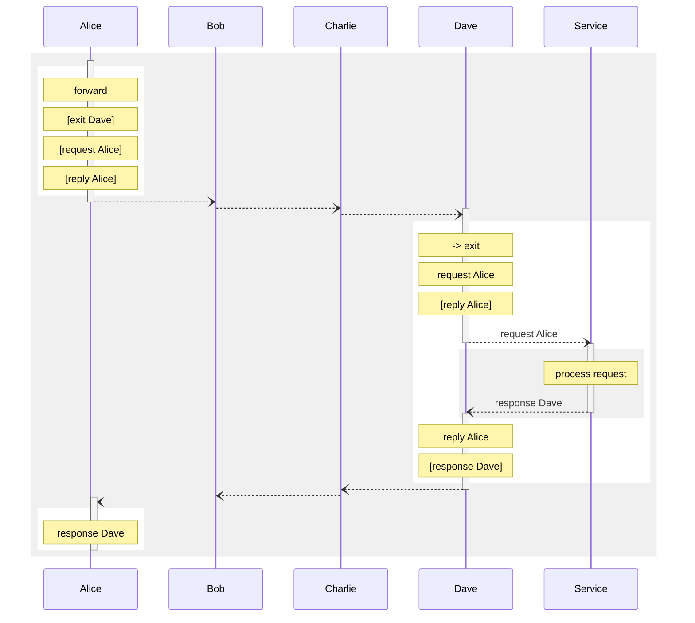
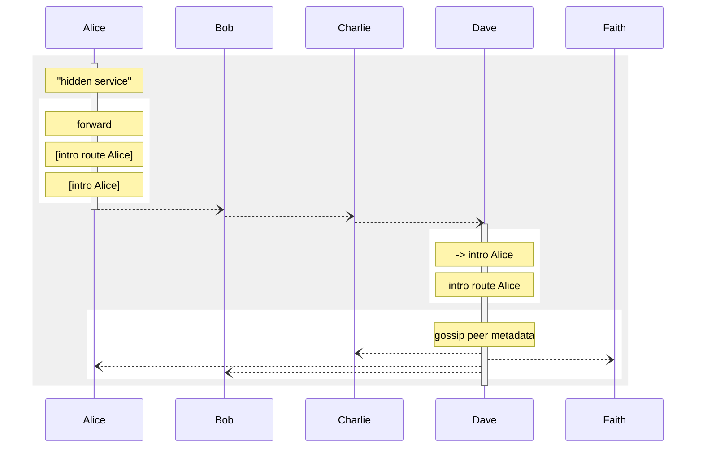
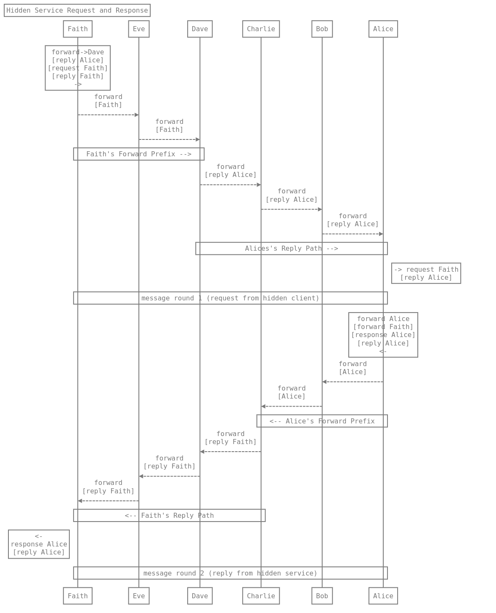

### protocols

## Cryptography

Several novel cryptographic protocols are used in Indra, they need to be understood as they are fundamentally the reason for many of the subsequent, more abstract and higher level protocols.

### Crypts, Header and Payload Keys, ephemeral private sender keys and cloaked receiver public Keys

**Crypt** is the generic name given to the data structure used in Indra to divide the layers of messages from access to unintended users. It provides some kind of clue about the way to decrypt the data, and the random nonces used in it.

```mermaid
```


Header and Payload keys are a pair of private keys delivered in a Session message, which the hash of the concatenation of the keys is the preimage used to pay for it, thus identifying with the payment the keys. 

It seems a bit odd to be sending private keys to a counterparty in a protocol, but for this case, it serves as authentication for triggering the accounting of the relay work done, and the use of the two keys will be explained in a moment how this is used to enable replies via source routing.

#### Composition of a Crypt

A crypt consists of a cloaked receiver public key, an ephemeral message/packet public key, a nonce, and after this comes the encrypted data.

There is no reason particularly to cloak the use of identity public keys, since these will pile up the longer an identity continues to exist. For this reason, it is important that part of the `v1.0.0` target is an easy way to roll these over, while in transition, prior keys will still work so that all databases are refreshed with the new key and use it for the receiver side of these ECDH encryption operations.

#### Session Life-Cycle

To start with, those private keys are anyway encrypted to the network identity public key of the relay that will provide service. This is the only time that the identity private keys are used aside from signing peer metadata messages. 

After the key has been used for some amount of data, the client simply expires the remaining balance, and to enable this, nodes allow a slight overspend on the last packet in a message. Thereafter a new session would be created.

#### Cloaked Keys

Cloaked keys are a way to mark an otherwise homogeneous looking encrypted message with a receiver identity, without leaking that identity to unprivileged outsiders.

The cloaked receiver public keys are simply using a random blinding factor, concatenating it to a public key, and then appending the truncated hash of this blob to the blinding factor as a prefix. 

The intended recipient can identify it they have a session on record that the cloaked key matches, simply by taking that blinding factor, concatenating it with each of its session keys, and if the remainder matches the truncated hash of this concatenation it matches and it then can use the corresponding private key.

With the public key in the Crypt message header, and the nonce, the intended recipient, with the matching keys can decrypt the message.

#### Header section and Payload section

The Header key, obviously is used for these headers. With forwarding instructions and crypt layers and such. The Payload key is used for message payloads, replies, specifically.

Not all messages involve a payload key, these are specifically to enable the Exit and Hidden protocols, where they enable the construction of a kind of "reply paid" envelope that has the required nonces and ciphers to encrypt the payload, which is not the same as the one from the header they attach in front of it.

Directly underneath the crypt, appears a few important bits of data, one of them being the offset point to find the end of the header and the start of the payload. From the offset point, the payload key will now decrypt, using the same nonce as the corresponding topmost layer of the onion.

## Codecs, Onions and Advertisements

**Codecs** are simply a 1 to 1 conversion between an in-process data structure and content, and a binary encoding that is made compact and efficient for network and disk usage. They form the basis of the more specific message type interface.

**Onions** are messages that have a slot to contain another message (and so on).

The way that they are to be processed is that there will be an encryption header, following the addressing information, and this header contains information relating to internal session data that is private between clients and the relays with whom the session is open.

This serves as both privacy, making it infeasible to casually read the message, and authentication, as the keys are only known by the privileged counterparty.

**Advertisements** are a type of message that is gossiped over the Kademlia DHT Publish/Subscribe subsystem of `libp2p` and cached by all peers, both relays and clients. Their distinctive structure is in their nonce, public identity key for the message, expiry (TTL) and the entire message is signed (and carried inside an integrity protected packet between peers), and signature must match the publisher public key.

These are how Indra peers distribute relevant state information and services available for clients and hidden services to construct their source routed onion messages.

## Public Services (Layer 1)

#### Client Side Location Confidentiality

### 1. Session Initiation Protocol

Forming the first layer of the Indra protocol is the simple parts of peer to peer communication and the construction of routing paths from gossiped network peer metadata, and the provision of the primary clearnet service, the `Exit`. An exit is basically a proxying request, and just as simple forwarding has a fee rate, exit services, called `Services` are charged at different rates, and on both relay and client side the accounting is done independently and in case of transmit failure or a long time offline clients can also query balances.

The primary facility given by the `Exit` is client side anonymity. The relays cannot directly determine from where the requests originate. Since this would otherwise be a spam magnet, none of these requests are fulfilled without the client first establishing session. Thus, the first protocol to discuss is the first step, paying for and confirming a session.

```mermaid
sequenceDiagram
participant Alice
participant Bob
participant Charlie
participant Dave
rect rgb(240, 240, 240)
    activate Dave
    note over Dave: gossip peer metadata
    Dave--)Charlie: 
	Dave--)Bob: 
    Dave--)Alice: 
	deactivate Dave
	activate Alice
    rect rgb(255, 255, 255)
        note over Alice: [generate session keys]
        note over Alice: LN payment and preimage
		Alice-->>Bob: 
        deactivate Alice
        Bob-->>Charlie: LN payment ->
        Charlie-->>Dave: 
        activate Dave
        note over Dave: receive payment
        note over Dave: [awaiting session keys]
        Dave-->>Charlie: 
        deactivate Dave
        Charlie-->>Bob: <- LN confirmation
        Bob-->>Alice: 
	    activate Alice
        note over Alice: send session keys
        Alice--)Bob: 
        deactivate Alice
        Bob--)Charlie: 
        Charlie--)Dave: 
        activate Dave
        note over Dave: receive session keys
        note over Dave: [session confirmed]
        deactivate Dave
    end
end
```

At this point, Alice now can send forwarding and exit messages to Dave until they consume the balance of milliSats remaining on the session.

Note that generally nodes create 5 separate sessions per relay, not all at once, but they are easily strung together as a forward message to send out to any number of relays one has paid for sessions with, to provide the matching keys that are concatenated and hashed to generate the preimage.

Also, it is currently idiom in the protocol implementation to count the position in a 5 hop round trip to isolate sessions to their given hop position when purchased. The first and last hops see the client's IP address, so it would leak information for the client to ever use these sessions that associate to their identity as a peer for other hops in the path.

### Initial Session Purchase

A few important points to note about the session message in the initial bootstrap for clients:

1. Generally, sessions will be bought in batches of 5, one for each hop position that they will then later be exclusively used in due to the leak of metadata that would occur if especially any of the inner 3 of the path were mixed with the forwards and return hops.
2. The Session message, if a payment is found that the private key pair provided hash to the preimage from the lightning payment, implicitly allows the remainder of the message, if any, be processed as though it was paid for (size limited), to use this to chain session purchases together. 
3. To improve security of these and their association with each other, the fact they were bought in a chain is noted in their metadata and repeating the sequence is avoided. It need not be prohibited altogether, but rather, the synchrony of the purchases associates them together. A clear case for the use of delay messages can be found here, as the LN payments can be batched out randomly first, and then only after they are all done, they are dispatched with a patterning such that the signal pattern that results is ambiguous compared to the sequence of the paths, which are known by the nodes (each knows where a message came from, and where it went.)

### 2. Tunnelling

#### Tunnels out of Indra

The tunnels out of the Indranet are called "Services". These are essentially anything whatsoever, but are confined to a 16 bit well known port to designate the protocol involved. This also includes Indra itself, which allows what we are calling "Path Punching", which is looping out of Indra and back into Indra. So as a default all nodes provide an exit path to act as a client of the relay.

This provides flexibility for client applications that may want to construct more complex paths while masquerading as relay traffic yet being exit traffic. Of course client applications could instead generate nonstandard length onions, for whatever reason. In the Lightning Network these long paths are based on the state channel availability, whereas with Indra it is network connectivity and thus all paths are available to use.

As has been discussed at great length in many writers words about the Tor network, the combinatorial mathematics of cloaking paths has a rapid rise of latency in exchange for a marginal increase in anonymity. Generally detection avoidance strategies on mixnets is best done by adding latency, or proliferating decoy traffic, after 3 hops of misdirection.

Decoy traffic will be discussed in later sections as there will be a reciprocal protocol for peers to perform decoy traffic. These decoys will require some method of checking the peer is in fact reciprocating, which will be visible in their peer to peer decoy sessions with each other. For the most part, having coincident timing and traffic volume emanating from a relay halves the chances of the right path being followed and thus reduces by a factor of 8 after 3 hops with decoying. Decoying is critical to enabling a low latency mixnet. Timing attacks get easier the lower the latency of the communication cycles.

#### Exit Protocol (Tunnelling)



# Private Services (Layer 2)

#### Server Side Location Confidentiality

Indra's default mode of operation is providing client side anonymity, for which the source routing model is very suited. But sometimes the service needs to also be private, and for this, further protocols are required to advertise the services without revealing the host. For reasons of logic and easier understanding, these are grouped under Layer 2, where the primitives and simplest client-side anonymity protocols are Layer 1.

### 1. Creating a hidden service

In this phase, Alice, who wants to receive inbound connections via a hidden service, sends out an introduction request to Dave, who will serve as introducer, via a 3 hop forward path.

As introducer, Dave will now gossip the `intro` over the gossip network (Kademlia DHT Pub/Sub), and everyone will have this intro or be able to query neighbours in case they didn't receive it.



At this point Bob, Charlie and Eve now know about Alice's hidden service 

### 2. Requesting connection from Introducer (Routing Request)

Faith has acquired an `intro` by some means and wishes to establish a connection to the hidden service. 

She forwards a route request, with an attached reply header to route a reply back to her, to Dave, the introducer for this illustration.

Dave then wraps up the route request and reply messages in the `intro route` it received along with the `intro`, which is used to forward one (1) request back to the hidden service.

> !!!! Here it might be good to mention that there is a flood attack vector here with creating unlimited numbers of `intro route`/`intro` over the gossip network. This, and the current lack of accounting for traffic to hidden services are both intertwined elements that fix this vulnerability. Nodes simply will require a high fee to accept an introduction, big enough that the spam use case is linearly more expensive than honest use.
>
> For the MVP this functionality will not be implemented, but we are already aware of it and will complete this after MVP.
>
> Also note there is no risk here of these 3 `intro route` packages being an avenue to unmasking, though in the request/response cycle this requires two forwards from the sender to ensure the receiver is not trying to unmask the client.

Alice then will receive the route request, with Faith's reply packet. Alice places her forward prefix, in case Faith also controls the first hop and thus would unmask Alice. This prefix is required in all messages in addition to the 3 hop reply in order to prevent either party unmasking each other.

This is not required for the first two steps of this part of the protocol because everyone knows the introducer, and neither client nor server would gain anything by controlling the adjacent hops on Dave's end of the path (last inbound, first outbound). But an attacker would want to attempt to unmask Alice, or a malicious hidden service would try to unmask Faith, and both cases are covered by each side adding their own two hops prior to the provided reply path.


```sequence
Title: Routing Request (establishing connection to hidden service)
Note over Faith: forward->Dave\n[route request Alice]\n[reply Faith]
Faith-->Eve: forward\n[Faith]
Eve-->Bob: forward\n[Faith]
Bob-->Dave: forward\n[Faith]
Note over Faith,Dave: forward->Dave
note over Dave: -> intro route Alice\n[route request Alice]\n[reply Faith]
Dave-->Charlie: intro route\n[Alice]
Charlie-->Gavin: intro route\n[Alice]
Gavin-->Alice: intro route\n[Alice]
Note over Dave,Alice: intro route Alice ->
Note over Faith,Alice: intro route Alice via Dave ->
note right of Alice: -> route request Alice\n[reply Faith]
note over Alice: forward Alice\n[Faith<-reply]\n[ready]\n[reply Alice]
Alice-->Charlie: forward\n[Alice]
Charlie-->Dave: forward\n[Alice]
note over Alice,Dave: <- prefix Alice
Dave-->Bob: forward\n[Faith]
Bob-->Eve: forward\n[Faith]
Eve-->Faith: forward\n[Faith]
note over Dave, Faith: <- forward path Faith
note over Faith,Alice: <- ready reply Alice to Faith
note over Faith: <-\nready\n[reply Alice]
Faith -> Alice: connection established
Alice -> Faith:
```

### 3. Request/Response Cycle

Once the receiver has the 'ready' signal, it can then begin a process of request and response wherein each reply carries the reply route header for the return path.

If a message fails the the parties keep past keys to decrypt latent messages or if it appears the outbound message may have got lost to retry a message using an older key since the key change message may have failed to get across before it arrived in the receiver's buffer.

Engineering more reliability into this requires the use of split/join message layers and layer two error correction compositions.



```sequence
Title: Hidden Service Request and Response
Note over Faith: forward->Dave\n[reply Alice]\n[request Faith]\n[reply Faith]\n->
Faith-->Eve: forward\n[Faith]
Eve-->Dave: forward\n[Faith]
Note over Faith,Dave: Faith's Forward Prefix -->
Dave-->Charlie: forward\n[reply Alice]
Charlie-->Bob: forward\n[reply Alice]
Bob-->Alice: forward\n[reply Alice]
Note over Dave,Alice: Alices's Reply Path -->
Note right of Alice: -> request Faith\n[reply Alice]
Note Over Faith,Alice: message round 1 (request from hidden client)
Note over Alice: forward Alice\n[forward Faith]\n[response Alice]\n[reply Alice]\n<-
Alice-->Bob: forward\n[Alice]
Bob-->Charlie: forward\n[Alice]
Note over Alice,Charlie: <-- Alice's Forward Prefix
Charlie-->Dave: forward\n[reply Faith]
Dave-->Eve: forward\n[reply Faith]
Eve-->Faith: forward\n[reply Faith]
Note over Charlie,Faith: <-- Faith's Reply Path
Note left of Faith: <-\nresponse Alice\n[reply Alice]
Note Over Faith,Alice: message round 2 (reply from hidden service)
```

## Troubleshooting Protocols

### Path Black Hole Discovery

When a transmission fails, by use of probing the interface of the failure (two nodes) can be determined through probing. The messages are made of 5 repeating units where each sends a confirmation packet in one direction and the probe packet in the other. 

These each arc back through three hops to the client, and the unresponsive points break the circuit and point to the not sending/not receiving path.

Peers can also probe peers indirectly in other ways, and this need for highly flexible composition of messages is a key guiding lodestone of the true north of Indra's design.

```sequence
Title: Path Black Hole Discovery
```


### Denial Of Service Soaking

In the same way that Cloudflare and other companies provide filtering services that soak up denial of service attacks through economies of scale, there is several ways, without risking creating a protocol level denial of service attack through collaborating on ban lists or time or these kinds of ways that distributed systems can become brittle.

A hypothetical denial of service attack against an Indra node could involve an attacker crafting onions to shower the target with quite large, but completely bogus packets, and due to the inherent fog of war that Indra exploits for anonymity, neither can this victim react in any way other than to simply disconnect from the network for a while.

But there is other ways:

- First of all it is important to remember that the longer the path an attacker is using, the more they are paying for it.

- Second fact to keep in mind is that the relays are deliberately dumb and simple and isolated. The only attack is denial of service. I mentioned Cloudflare, and of course I'd imagine similar kinds of services would spring up to boost the baseline protection against anonymised DoS attacks.

The protocol level solution here, anyway, is to have a, "please don't forward from the sessions tied to the messages that went to me that were falsely addressed, blobs of useless junk, for 10 minutes". 

Or something like this. 

This is where the reciprocal payment element can be seen coming into play as a mechanism that can serve to fund precisely this cooperative, confidentiality-preserving, time limited filtering requests.

Nodes pay their peers to not forward them! They don't care where they come from, just those sessions are malicious IMHO and just *take my damn money*. And the request is time limited, so it isn't another resource exhaustion vector.

Money is a very powerful motivator and a money that is limited in supply is a very powerful spam preventer.

The DoS protection is likely only to cover a thin margin at the edge.

