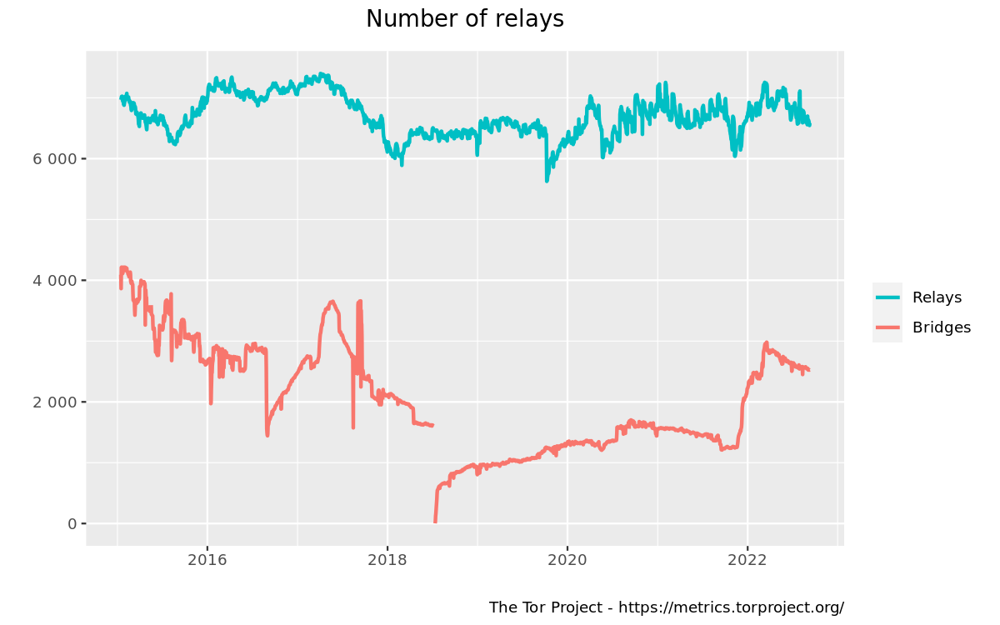
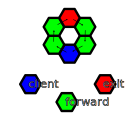

# Indranet Protocol White Paper

#### Onion routed distributed virtual private network protocol with anonymised payments to create scaling incentives.

> херетик September 2022 - January 2023

# Abstract

The state of counter-surveillance technologies has remained largely unchanged in
the 20 years since the inception of the [Tor network](https://torproject.org).

The primary use case has always been obscuring the location information of users
from clear net sites, and the more it has been used for this purpose, the more
hostile clear net sites have become towards this network, due to its frequent
use
to launch attacks on web services.

With the increasing amounts of value being transported in data packets on the
Internet since the appearance of the Bitcoin network, the need for eliminating
the risks of geographical correlation between payments and user locations
continues to rise.

However, without any way for users to pay routers without creating an audit
trail, the anonymising networks have not grown in nearly a decade, and
thus well heeled attackers have largely been able to keep pace and pluck off
high value targets, such as
the [Carnegie Mellon University](https://blog.torproject.org/did-fbi-pay-university-attack-tor-users/) -
implicated in part of what led
to the arrest of the Silk Road founder, Ross Ulbricht.

It is the central thesis of this paper to demonstrate how obfuscating
correlation between payments and session usage can be achieved and create a
marketplace in routing services which can economically increase to a size that
is beyond the capabilities of a state sized actor to fund an attack, while also
improving latency and stability of routed connections.

# Contents

- [Tor Isn't Scaling, But Bitcoin Needs Onion Routing](#tor-isnt-scaling-but-bitcoin-needs-onion-routing)
- [How Indranet Improves Upon Existing Mixnet Designs](#how-indranet-improves-upon-existing-mixnet-designs)
    - [Active Attacks](#active-attacks)
    - [Artificial Gap (packet dropping/delay) and Artificial Bursts](#artificial-gap-packet-droppingdelay-and-artificial-bursts)
    - [Timing Analysis](#timing-analysis)
- [Why We Need Indranet](#why-we-need-indranet)
- [General Principles of Indranet Protocol](#general-principles-of-indranet-protocol)
- [Protocol Concepts](#protocol-concepts)
    - [Packet and Message Encryption](#packet-and-message-encryption)
    - [Signing/Encryption Key Generation and Message Segmentation](#signingencryption-key-generation-and-message-segmentation)
    - [Onion Path Topology](#onion-path-topology)
    - [Return Path Routing](#return-path-routing)
    - [Ping Messages and Path Failure Diagnosis](#ping-messages-and-path-failure-diagnosis)
    - [Client](#client)
- [Payment for Traffic](#payment-for-traffic)
- [Proof of HODL Consensus](#proof-of-hodl-consensus)
    - [Anonymous Probabilistic Feedback Propagation](#anonymous-probabilistic-feedback-propagation)
    - [Rate Limiting](#rate-limiting)
- [Relay to Relay Traffic](#relay-to-relay-traffic)
    - [Relay to Relay Encryption](#relay-to-relay-encryption)
    - [Dynamic error correction adjustment for Re-transmit Avoidance](#dynamic-error-correction-adjustment-for-re-transmit-avoidance)
- [Client Path Generation Configuration](#client-path-generation-configuration)
- [Hidden Services](#hidden-services)
    - [Fully Anonymous VPS Hosting](#fully-anonymous-vps-hosting)
- [Proxy Service](#proxy-service)
- [Private Relay Services](#private-relay-services)
- [The Indra Tax](#the-indra-tax)

## Tor Isn't Scaling, But Bitcoin Needs Onion Routing

For comparison, this is Bitcoin's node count:

Versus Tor in a comparable period:

It is not hard to see:

- Tor is not growing, it has flat-lined.

- Bitcoin is growing.

Not only that, you can also see that onion routing is forming an increasingly
large component of Bitcoin connectivity.

## How Indranet Improves Upon Existing Mixnet Designs

Indranet, in contrast to other anonymising network designs, is
pure [source routed](https://en.wikipedia.org/wiki/Source_routing). This means
that only the clients know the full path along which their traffic moves, and
relays have no influence on the path of traffic aside from failing to deliver
it. It is similar in many ways to the [HORNET](./1507.05724v1.pdf) mixnet
protocol.

Many of
the [vulnerabilities](https://en.wikipedia.org/wiki/Mix_network#Vulnerabilities)
of mixnets relate to the relays having the ability to change the path of
traffic. In Indranet, relays either forward traffic as instructed, or not. To
some degree, source routing creates protection against byzantine type faults,
because failure to deliver and most malicious attack methods result in clients
distrusting the malicious nodes, the same way as they distrust unreliable nodes.
Because unreliable nodes cost clients money, effectively, malicious nodes will
be quickly forgotten and end up being used by nobody.

### Active Attacks

It is not possible for adversaries to modify packets without effectively
breaking the path, as messages are integrity protected by cryptography that is
opaque to other than the client and the at each layer, the relay that will
forward or process the message. This can adversely effect the randomly selected
next path because it may be inferred that possibly the receiver is faulty rather
than the sender. The client will use probes to check the liveness and latency of
the path, and by a process of elimination it will determine the sender is faulty
and deprecate it from further use, potentially eventually fully blacklisting it
and not sharing the node's existence with peers.

### Artificial Gap (packet dropping/delay) and Artificial Bursts

These attacks fail because the client will determine via ping probes that nodes
are failing to execute the forwarding/returning of packets and this will
gradually result in the malicious nodes not being shared by clients altogether,
not just way down the scale of reliability. It is part of the contract of
operating a relay on Indranet that your node follows the instructions given to
it.

### Timing Analysis

Discovering the relationships between clients and the services they are
connecting to is the essence of all of the attacks on mixnets. Indra takes
several approaches to resolving this issue:

- **Packet scheduling is shuffled constantly** - Relays do not simply behave as
  First In First Out buffers, but rather, mix together the messages they
  receive. All messages have to be segmented for network transport, and as these
  segments are fed into the outbound queue, they are shuffled so that the
  ordering is broken up. This slightly increases latency but it decreases
  associativity between streams of packets constituting messages.
- **Deliberate delays** - This is a tactic that is more often seen in email
  mixnets but can be used to a degree in lower latency mixnets like Indranet
  because not all traffic is time critical. Bitcoin transactions and blocks are
  relatively time critical, but DNS requests can comfortably take up to 100 ms
  without disrupting the functioning of ancillary centralised type services
  using them (IE, DNS for web traffic). Email is also a potential service type
  on Indranet, and because it is inherently slow and non-interactive, the delays
  can be even longer, potentially several seconds to deliver, and so the
  segments of the packets as they pass through will not have strong timing
  correlation. The delays are defined by the client, and raise the cost of the
  data from a regular non-delayed message by a percentage in proportion with the
  length of the delay.

## Why We Need Indranet

Three key elements of the Tor protocol make it less than desirable in general.

1. **High Latency** - Establishment of circuits is quite slow, taking a large
   number of steps
   to "telescope" into a circuit.

2. **Low Reliability** - Once a circuit is running, when it fails, the failure
   is opaque to the client
   side, and there is no way to provide a latency guarantee or connection
   stability. It is unsuitable for interactive *and* long living connections.

3. **Poor Scaling Incentives** - There is no profit motive to drive expansion of
   relaying
   capacity, weakening anonymity by not expanding the anonymity set to cope with
   a rise in the number of users. As the charts showed in the foregoing, there
   is around 8,000 nodes, of which 6,000 are relays and the remainder private
   bridges, but the average daily user count of Tor is around 100,000 users.
   Both numbers could be a lot higher if running a relay wasn't a money losing
   exercise, and if the system could handle interactive grade latency and very
   long living connections.

Tor is a poor solution for a very limited subset of the use cases that
benefit from the security of route obfuscation. Indra aims to provide what Tor
has definitely now failed to achieve for a large majority of internet users for
all purposes:
location privacy.

Indranet does not aim to compete with Tor for the use case of tunneling out to
clear-net websites and services: the focus is on obscuring the source of traffic
within decentralised, peer to peer protocols like Bitcoin, Lightning Network,
Bittorrent, IPFS, and other similar, decentralised protocols. Enabling such
services are possible for relay operators to do, since they can offer a Socks5
tunnel exit service on well known web service ports, though this feature may be
integrated later, but not enabled by default.

## General Principles of Indranet Protocol

There is four main types of traffic in Indranet:

1. **Peer to peer protocol chatter** - sharing lists of known network nodes,
   their advertised exit services, and collaboratively generated statistics on
   bandwidth and uptime, their long lived public keys for session initiation,
   and hidden service introducers.

2. **Purchase and topping up of bandwidth sessions** - Combining with the use of
   Lightning Network to perform payments to proxy nodes, and specially formed
   layered encryption of messages, enabling clients to acquire sessions that
   grant users the ability to relay arbitrary traffic through relays.

3. **Liveness diagnostics** - When messages fail to circle back to the client
   that are expected to, an Indranet client can perform a diagnostic message
   protocol to discover which nodes are failing automatically to avoid using
   them and causing failed transmissions.

4. **Relaying messages to network services** - This is the bulk of traffic,
   relaying messages from clients to their intended destinations inside the
   network.

## Protocol Concepts

### Packet and Message Encryption

Indranet uses a message encryption scheme based
on [Elliptic Curve Diffie Hellman](https://en.wikipedia.org/wiki/Elliptic-curve_Diffie%E2%80%93Hellman) (
ECDH) key exchange.

The message and packet headers contain the following elements:

- **Message checksum** - 4 bytes of the truncated hash of the remainder of the
  message or packet, for preventing tampering and ensuring integrity of the
  message.
- **Initialisation Vector** - cryptographically secure random value used for the
  payload encryption.
- **Cloaked public key** - generated via the use of a strongly random 3 byte
  value that is concatenated with the receiver's public key, and the first 5
  bytes of the combined hash is concatenated to the 3 byte nonce value to
  prevent inferring association of a stream of message packets with each other.
  This key also acts as a session identifier, and must be cloaked in order to
  not provide information to malicious nodes who would then be able to correlate
  messages.
- **Public key** - In order to enable the receiver, who knows the cloaked public
  key's private key, to be able to generate the message encryption cipher, the
  public key is included in the header of each message and packet.

### Signing/Encryption Key Generation and Message Segmentation

The signatures on messages must be different for each subsequent message, and
when a message exceeds 1382 bytes (based on a 1410 byte MTU, typical for mobile
networks) the message will be segmented into pieces of this size, the last
packet padded out with random based hash chain generated noise.

These keys are generated by creating two secure, secp256k1 private keys, the
base and the secondary, and the base is scalar summed with the secondary to
produce a new key, and this new key is then used again the same way for
subsequent keys.

This scalar sum operation guarantees that the new private key is also a valid
secp256k1 curve point (values not in the curve weaken the encryption), and can
be performed very quickly without the resultant key being outside of the curve.

This scheme is more aggressive than the Signal Protocol's Double Ratchet
algorithm, which was designed for low bandwidth short message systems, and it
consumes a fair bit of processing power. Benchmarks of initial implementations
show that a single thread of a Ryzen 7 2021 mobile processor can process more
than 100 mbit per CPU thread, which is more than fast enough for a gigabit
dedicated relay with at least 10 CPU threads (and usually, 6 to spare for the
rest of the work).

### Onion Path Topology

Indra uses a single topology that provides two hops between the client and the
exit/endpoint being connected to. Only two are required to provide optimal
anonymity - the first hop can infer it received a message from a client, but the
second hop cannot, as it did not, and while most clients are not also providing
relay service, a lot will also run one it, especially such as hidden p2p
services or multi-server setups that forward inbound requests one or more
separate servers providing the services offered at the exit.

Because it is mostly not possible to fully hide the fact that a node is a
client, there is separate sessions for each of the 5 hops in the circuit. First
and last hop sessions can make session balance queries directly, whereas for the
other 3 hops it uses the standard path, except in reverse for the second last,
and randomly, exit point to perform these queries, and the last two hops and the
return hop carry back the response.

Because Indra is source routed, every single request can pass through different
paths, eliminating observable correlations between clients and relays for
attempts to unmask users, and eliminating any discretion a relay can have about
where traffic is forwarded - it either goes, or it does not. Attempts to attack
users anonymity by delaying or dropping messages by evil relays will violate
expected relaying performance parameters and the offending nodes will be
downgraded in their selection frequency as punishment. Tor and I2P have
limitations on how many paths they can open at any given time, whereas Indra
can, and by default, does choose different paths for every single message cycle.

### Return Path Routing

As distinct from most mixnet implementations, interactive connections are not
built out of chains of bidirectional connections between the hops in the
circuit. The outbound message path is entirely unrelated to the inbound message
path, except that the client initiates the messages outbound first, and must
always.

This means that for "push" type interactive services, the client must send out a
message containing the reverse path to deliver "pushed" messages. But
fundamentally this is how websockets work anyway, using a subscribe message to
start listening, the difference being that the client must send new return
message headers in order to get responses.

To support the connection type model of HTTP, the protocol always pushes a few
extra reply message packets in addition to the ones associated with a given
outbound message, so that if more replies come back it can keep prompting for
more to come. This is a limitation of source routing with anonymity, as the
reply path is entirely under the control of the client.

### Ping Messages and Path Failure Diagnosis

Because there is several intermediaries in paths in Indranet, and a failure for
the response or confirmation to arrive in a timely fashion can mean a failure in
any of the nodes in a circuit. The first and last hops can be openly probed for
operation using a Get Balance query (which is a single hop out and back), but
the others must be diagnosed differently. The reason being that using relays for
the outer 3 hops at the same time as using them as first hops would potentially
unmask the location of the client associated with the session.

Thus, the ping message, which consists of 5 hops using the forward-only relaying
instruction message, can be sent out several times to pass through these inner
hops of the failed path. The failing node will not forward these messages and
thus the confirmation of the ping will not arrive back at the client. Of course
it can be that the randomly selected other relays in the ping path also are
failing, which can then require further probing, using sessions that already
proved to work until the one or more hops in the failed path are identified.
While the process of diagnosis is occurring, Indra will not choose the relays in
the failed path until the diagnostic is completed.

When a delivery failure occurs, Indra will inform the client application by
returning a connection reset by peer message so the client retries, and Indra
then uses a different path that does not include any of the relays from the
failed path until they are diagnosed.

### Client

Unlike Tor and other anonymising protocols, every client has the capacity to act
as an **exit** for traffic while it is online, for at minimum, Bitcoin and
Lightning Network messages. They advertise themselves as "unreliable" exit
nodes, this descriptor indicating that they are intermittently offline, and do
not attempt to stay online. This will also mean they don't get a lot of traffic
but users on the network will be able to use them when they see a status update
on the peer to peer network.

Users primarily using Indranet as clients can also gain an increase in their
anonymity by also running a relay. This is generally not advisable on mobile
devices since their intermittency and the latency of the p2p network DHT updates
make them impractical for frequent use, but when they are online, they can be
used, and the payments on their sessions can be used later to balance their
channels, and amortise some of their relay session costs.

Because of the unreliability of especially mobile clients providing relay
service, they are not subject to the same consensus about reliability, but will
mainly be selected as exit points when they are online as a way to further boost
the anonymity of the services being provided. And of course this will include
hidden services, which can be leveraged for peer to peer protocols on the mobile
devices.

## Payment for Traffic

Using [Atomic Multi-path Payment](https://docs.lightning.engineering/lightning-network-tools/lnd/amp) (
AMP), relays advertise their LN node public keys alongside their Indra identity
keys, they send a message constructed as follows:

- Preimage hash of the forward and return private keys that will be delivered
  after payment to prove payment and provide the keys for handling return
  messages.
- Amount of bytes the payment is for.

The payment will be for an amount of satoshis in accordance with the rate
advertised by the seller, and the amount of advance payment the client is
willing to put forward. There is no direct return confirmation in this process.
As with the rest of Indranet's design, the client is in control of everything,
tightening the security.

In the initial bootstrap, the client will send out 5 such payments to establish
enough hops to form a secure path. With 5 payments made, relating to 5 sets of
header/payload keys by the hash of these keys being the preimage used.

Then after sending out the payments with the preimages to the relevant relays,
the client then sends out a "SendKeys" message which provides the relay with the
two private keys that both identify the session being used in a hop in an onion
message, as well as provide the relay with the necessary keys to unwrap their
layer to be processed.

## Proof of HODL Consensus

Following from the model of loyalty building between customers and businesses in
the open market, a number of consensus rules and protocols help reward honest
nodes and reduce the impact of bad behaviour in both clients and relays that
harm the security and value of the network.

Decentralised, and especially anonymous networks have a primary common
vulnerability to Sybil attacks, since identities can be created in large numbers
and used to overwhelm a network with false information.

In order to prevent this attack there is a number of rules that honest peers
follow, and mechanisms by which peers on the network evaluate each other on the
relay and client side both.

1. To rate limit the creation of new nodes on the network, nodes must make an on
   chain Bitcoin payment with a time delay back to themselves, and after a
   period of time they can then repeat the transaction, the latest head of the
   chain of transactions tied to the original TXID must be active in order for
   nodes to use the relay.

   The size of the value of the time locked UTXO is a factor in node selection
   to weight probability, lower than the factor of age in first time usage by
   clients.

   The UTXO hash is signed by the UTXO's private key in the node identity,
   proving ownership. It leverages the strong security of Bitcoin to anchor a
   relay identity to a definite time as well as raising the new relay identity
   creation cost in the short term.

   The fees a relay pays to renew can be zero, but this will reduce their
   ranking during the interim periods after one expiry and the next activation.

   Bigger UTXOs expire later than smaller, so the more a relay defers spending
   the more reliable they intend to be, and cutting down their transaction fee
   overheads. Sybil attacks rely on cheap identities, this creates a dilemma for
   attackers, who must lock up more for longer if they want to be more likely to
   win new loyal client customers, and putting a cap on how many Sybil clones
   they can create for any hypothetical get paid but not deliver attacks.

   The expiry times must conform to the rules of the network, as a ratio of
   satoshis and blocks, some deviation is allowed, but the point is that smaller
   time locked spends must expire sooner and thus cost more in transaction fee
   overhead, it is just better to sink more than less, as well as it raising the
   probability of first time selection by clients.

2. The age and cumulative time active for a TL UTXO is also used as a factor in
   the evaluation of the reliability of a peer. No matter how big the UTXO the
   clients will not pick it with higher probability until the relay has remained
   operational in a time/value weighting formula.

3. For relays a client has used, the ones with the highest rates of fulfillment
   are weighted above all else. The previous two criteria are more used for
   distributing risk of first time use of a relay, so as to minimise the
   unfulfilled sessions versus delivered. At the same time, a client also needs
   to slowly shift its session usage around, and thus also try new relays out,
   and intermittently cease using some of its known and trusted relays for
   traffic for some period, which is necessary also for the feedback system
   described in the next section.

### Anonymous Probabilistic Feedback Propagation

In order to create a feedback loop between relays and clients, both relays and
clients share random selections of known peers with each other that have been
given a weighted probability of selection in the message of this small subset.

The p2p layer ensures that any node can discover with fairly high convergence of
the current full list of peers on the network if desired. This is a separate
process that works a little bit like "shout-outs" in social media.

In order to prevent the correlation of esteemed peers to a client's currently
active traffic, the most recent activity and volumes of traffic over their
circuits is weighed to not leak current connection data in close time proximity
to this chatter.

The messages are only sent out once a day, and in proportion with the time known
and the amount of first/last hop connection traffic sending these "shout-outs"
are then combined with the frequencies of clients' recommendations lists allows
long serving customers running honest clients to evaluate their peers in a way
that doesn't either unmask them or enable spammy advertisement from constantly
new clients attempting to poison these scores.

> With the combination of a form of lightweight bonding, timestamp anchoring to
> Bitcoin with proof of ownership, subjective histories of fidelity and a
> probabilistic feedback mechanism, it will be difficult to find a way to make
> income from Indranet without actually delivering service.

### Rate Limiting

Because inherently anonymous, and especially source routed traffic volumes
cannot be controlled by the use of client identifiers, Indranet needs a
mechanism to enforce bandwidth limits and prevent congestion caused by the
coincidence of many clients selecting a relay at the same time randomly.

When a relay is exceeding its momentary traffic volume limit, as set by the
relay operator, it will delay processing of message, and if the volume continues
to flood, it will start to drop packets. This is obviously a potential vector
for attacking a specific relay, but because although clients are not
identifiable, sessions are, the sessions with the highest volumes will be
dropped before lesser volume messages.

Such sessions are clearly being used by attackers, and rightly can be denied,
even if the session has allocation remaining. Thus, the messages are not only
dropped, but the sessions balances are decremented as though they were relayed,
as further punishment.

In order to help smooth out the naturally fluctuating traffic levels, every exit
session the relay processes, in the reply header of the response there is a
single byte value that informs the client of the current utilisation rate as a
percentage represented as a value between 0 and 255. Clients will then record
this information in the session database and nodes with high utilisation will be
reduced in their odds of selection for a path. Updating this data will be
client-driven, and be based on the existing probabilities of selection as used
to pick hops for paths.

Non-exit nodes do not have the ability to pass such messages through on the path
to and from the exit, so in addition, a longer period EMA of utilisation rate (
traffic vs configured bandwidth capacity) is published to the p2p DHT and
propagates to clients at lower time precision. Since this specific update is
quite important to the network consensus, the client will try to also shuffle
paths around so that circuits using a relay for an intermediate hop also is used
as an exit point where possible.

Requesting this information to peers would leak client's current running
circuits to peers, so relays will interpret an exit message with no request data
to be a utilisation state request and return this byte in a reply with no body.
Clients will send out these empty requests randomly in the same way as the
relays are chosen for paths to gather advance intelligence about potential
congestion, and avoid a given relay for a while until a later request reveals
the relay's traffic has returned to nominal levels.

With the combination of periodic updating of longer time windows of recent
activity from the p2p network, and the direct queries via empty exit onions,
clients will avoid overloading relays. Users will even be able to define a
threshold for "too busy" for a peer at a lower level in order to get a better
latency guarantee, indeed, some service ports relate to applications with high
interactivity and these can be automatically evaluated using this different
threshold and achieve low latency as well as preventing network congestion.

## Relay to Relay Traffic

Messages are segmented into 1382 byte segments and reassembled by relays when
they receive them. The relays return an acknowledgement being a signature on the
hash of the packet data (which includes the checksum prefix), and these are
dispatched in a stream after shuffling already queued messages by the sending
relay, as well as interleaving messages passing to the common next hop when this
happens.

If a message fails to be received on the other end, the relay will retry the
send a few times before giving up. Unfortunately it is not possible, while
minimising packet overhead, to allow intermediate hops to return replies (it is
around 250 bytes), and so from the client's perspective, the message has failed
to be delivered as it does not receive the expected return trip confirmation or
response, and it is impractical to then return a failure response back to the
client.

By not allowing such back-propagation in the protocol, attempting to attack the
network by disrupting protocol packets with delays, corruption and dropping does
not prompt a reverse path chain of messages that lead from the intermediate hop
to the client.

Because it is not possible, due to protecting anonymity, to connect an
intermediate hop with an exit point's sessions, clients are simply in the dark
when a message fails to travel forwards, and by the use of a time to live on the
return path (which clients open after sending out a message to enable the last
hop to send back the reply) for a given service type, the client caches the
forward message payload and exit point after sending them, and then flushes them
from the cache once they receive the confirmation/response.

If it does not arrive before the TTL for the service type, the client will then
construct a new path to deliver the message to the same exit a few more times
before giving up. This value will also have the requested packet delay total
added to it when there is delay messages in the onions. Failed messages may turn
out to be failing on the return path, so on the other side, when a request is
received, it is cached for a little while in case the request is sent again with
a different return path, though it only needs to store the request message hash
to achieve this.

### Relay to Relay Encryption

In order to further secure traffic, relays in their chatter with each other
provide private relay-to-relay keys to use for message encryption. These are
rolled over in accordance with the traffic volume between the peers.

### Dynamic error correction adjustment for Re-transmit Avoidance

Based on the conditions of the paths between two relays, by the ratio of packet
loss the nodes adjust the error correction to use in order to maintain a margin
above the current loss rate, built using a moving average of successful
deliveries versus failed between the two relays.

## Client Path Generation Configuration

A flexible configuration system for selecting paths and exit points is required
to cover several different types of use case of obfuscated traffic paths.

- Geo-location based exit and route hop selection:
    - Users may need to avoid using exits within their own or some specified
      outside jurisdiction.
    - Users may specifically want their exits to emerge in a specified
      geographical region.
    - Users may want to specify, or avoid selecting intermediate paths in a list
      of specified geographical regions.
- Selection of specific routers for exits for a given protocol:
    - Using a user's own servers, this can be generalised to allow remote access
      to a server controlled by the user.
    - A company may provide specific services that users can access at a given
      set of addresses, whether IP based or domain based.

Simply providing the IP or domain name of the endpoint to the built in Socks5
proxy will also pick the exit if it is an Indra peer, which makes servers like
Bitcoin and LN nodes transparently reachable over Indranet without any user
intervention, and makes Indranet the default path for all of the Indra relays
when they connect to Indra peers.

Since the net effect will be that relays will spend the same amount on
tunnelling to other Indranet LN and Bitcoin nodes as others do to their own, the
relays will be able to use this to prompt usage of nodes with imbalanced
channels to correct their inbound liquidity. And of course this increases the
amount of traffic and thus the anonymity set to include not just client
initiated traffic but relay initiated as well.

## Hidden Services

Because Indranet is source routed, unlike the connection oriented onion paths
that Tor uses, it can avoid the potential problem of all of its rendezvous
points becoming congested and impacting user experience via increased latency
and dropped packets. It requires more than 6 hops but these are changed at every
message cycle.

1. The hidden service selects a set of 6 randomly selected relays to act as
   introducers. It sends out a few messages to the relay so that it can handle
   several requests and a reply header to request more.
2. The client contacts the introducer and requests one of there routing headers,
   and the introducer delivers one and also sends back a reply to the hidden
   service in its pending reply packet provided precisely for requesting new
   routing headers, and the hidden service duly dispatches a new one on a new
   path.
3. The client then creates a 2 hop, but 3 layer "reverse" header, then puts the
   routing header provided by the introducer inside it, so the second hop
   unwraps it and continues to forward the rest of the onion. And then at the
   end of the message just before the request payload, it provides a 3 hop reply
   path, two intermediaries and its own randomly selected session keyset.
4. The packet arrives at the hidden service after the path defined by its 3 hop
   header, it dispatches the payload out to the connected service for the
   message, and then creates another two hop, but 3 layer "reverse" header,
   which it then wraps the client's routing header, and attaches the response
   payload to it, with the hash of the request payload to identify what request
   the response relates to, and lastly, the next 3 hop routing header like the
   one the introducer provides, enabling the next message cycle.
5. Embedded in the payload part of the routing headers on both sides is a 64 bit
   nonce which acts as the connection cookie to identify quickly what connection
   a message relates to, which is translated into a fake hexadecimal pretend
   domain name, enabling a web service to block this connection if the app
   determines the client is up to mischief.
6. To minimise DoS attack potential in repeatedly requesting routing headers and
   then not using them, the introducer node charges a substantially larger fee
   for delivering the routing headers, raising the barrier against such attempts
   to congest the introducer's message stream back to the hidden service. After
   a message session has gone quiet for a timeout period, maybe around 1 hour,
   the last delivered routing header is expired and cannot be used to continue
   the hidden service connection.

With this scheme, the anonymity of both sides of the connection is maintained,
at the cost of the extra 4 hops versus the potentially small channel created by
a set of 6 rendezvous nodes in Tor. Because all the processing is done at the
endpoints, the trip time is a little longer, but because it is dynamically
generated, peers can minimise bottlenecks along the path through their constant
updating of reported utilisation levels for relays both on the p2p network as
well as via the replies to exit onion messages.

And of course, in stark contrast to Tor, the paths change every time meaning
that timing patterns require a far larger number of evil nodes to capture
meaningful patterns, a difficulty level that rises asymptotically with the
number of relays and clients on the network, as well as the advantage of source
routing eliminating the ability for evil nodes to reroute traffic.

### Fully Anonymous VPS Hosting

With the use of Indranet's hidden services protocol, in theory a user can
establish an account with a remote VPS rental provider that uses Indranet, with
an package that includes a pre-installed instance of Indranet (not providing
relay service, but appearing in the peer DHT), running a certificate
authenticated SSH endpoint, and then install whatever applications they want,
hook them up to the server's service configuration, and thus remain completely
anonymous and untraceable to the public IP of the VPS. In this plain
configuration the user knows the IP address of the server's Indra node.

Or it can even go one step further, where even the server IP address is hidden,
connected by a point to point connection to the provider's network
infrastructure, which further increases security against an application breach
leaking the IP address of the hidden services running on it. Neither the
provider, or the client know anything about each other, and thus cannot be
connected together, and likewise, none of the clients of the hidden service will
reveal any location data by default to the applications on the server.

## Proxy Service

The client will run a Socks5 proxy, which users then set up as their web
browser/other proxy for connections. This proxy will make DNS requests via
Indranet for the names in the requests, whether Indra hidden service addresses
or clearnet addresses, forwarding the name resolution request out to random
Indranet relays, who send back the IP address replies.

Requests for forwarding to a specific Indra relay can be specified by an address
matching the relay's IP address, or the zero address, meaning randomly select
the exit, or a regular domain name for the case of relays that provide tunnel
exit services. As mentioned previously, relays automatically route Bitcoin and
LN traffic over Indranet to Indranet Bitcoin and LN nodes.

Relays that wish to provide tunnel exit service simply place a Socks5 proxy
listening on their localhost service ports, inbound connections for these
services are then forwarded through the proxy which then resolves names via
Indra to dissociate this request from the exit, and forwards the messages and
routes the replies back to the clients using the exit header reply segment.

In this way, a user can run a bitcoin or lightning wallet or other client
application, and set its proxy to the Indra client's proxy and they will then be
able to tunnel out to the endpoint, in the case of Indra nodes offering this
service, or via tunnel exit services for addresses not part of the Indranet
swarm, no modification required except to add the proxy configuration to the
server, or even to the operating system settings to enable proxying
automatically for any application that knows how to use the OS proxy setting. Or
indeed, just providing this outbound routing service to only a specific set of
ports.

For software that does not have the ability to use a proxy, the Indra client
also opens listeners on localhost addresses for configured port numbers, and
then using server configurations' "connect only" type setting, establish a path
to a single, randomly chosen Indra peer that provides this service, and of
course many of them can be set up as needed. The caveat to this is that during a
session, if it were desired to change the endpoint the path leads to, this has
to be tolerated by the protocol, that it be ok for an endpoint change to occur
periodically, or on every request.

Peer to peer applications may or may not tolerate the apparent change. For
services that have no concept of association, like a Bitcoin or other
distributed application service RPC API, it is fine for each new request to take
a different path and go to a different endpoint. Configuration will allow fixed
endpoints (that don't change during a run), a rotating change of endpoint, and a
period in which the endpoint is rotated if it is set to rotate, or a new
endpoint each time.

However, since most p2p applications understand the use of Socks proxies, this
won't be a frequent requirement, and is of lower priority for implementation
than the straight Socks5 proxy.

## Private Relay Services

To enable users to use Indranet as a transport for accessing private servers,
deployments using the `Neutrino` SPV bitcoin node and `lnd` can configure a
public key certificate that they can use with a private key, in a similar way to
SSH certificate encryption, to enable routing from any client to their specified
node identified with its IP address, where there is a relay running at that IP
address with the public key registered as enabling access to forward connections
to a defined loopback address where the hidden service is running.

This will enable SSH, FTP, and similar services for users to be accessed via
Indra, while preventing third parties from identifying the origin of access to
the server. This will also enable things like remote desktop access, but it does
not include rendezvous routing. It can also, as previously mentioned, to hide
the destination point as well using hidden services.

## The Indra Tax

Here at Indra Labs we like to call a spade a spade, and we will be establishing
in our distribution of the Indranet clients and relays the default establishment
of Lightning channels through our peer to peer network seed nodes, which will
charge market-typical routing fees to connect clients to the Indranet swarm's
Lightning nodes and enable payments. Because we make this the default, and by
default relays only connect to other relays and the seed nodes, effectively we
can levy a kind of toll for the delivery of payments.

We intend to also offer the option for investors to, preferably independently,
run seed nodes, under the conditions they request, which can include our
promotion of them on our website and communications. It is better that there be
several independent entities involved in this, and of course the fees their seed
nodes collect will be part of their reward for this service.

Session payments are always routed through long paths, as permitted by the
Lightning Network protocol, selecting a seed node first and then to several
intermediary nodes in the swarm before reaching the destination. Users will be
able to verify by enabling payment logging, and see a recent history of payments
and the hops that the Lighting node in the client used to construct the payment
message.

The channels between clients and seed nodes are bidirectional, and users can
then add to their client balance by sending payments to an invoice their client
creates for adding funds to it. The amount of satoshis in their channels will be
at their discretion, though the client will alert them that their channel is
empty in order to prompt the user to fill it back up. Seed nodes will collect
routing fees on both directions, of course.

The size of Indra client Lightning wallet balances is dictated by the user, but
in general it does not need to be very large, as it will likely process maybe
several US dollars worth of traffic a day for most users, it is just a matter of
convenience to make them larger. Rather than close them and establish new ones,
when users want to increase their wallet balance they can simply establish more
channels to the seeds, and avoid closure fees. Since a user is not going to pay
into their wallet unless the client is running, these channels are ok to be
offline the rest of the time.

Users can also configure their client's Lightning node to open other channels to
the Lightning Network as they wish, by pointing their wallet application to the
IP address of their client, or if they are technically inclined, via `lncli`, as
we are using `lnd` as our primary LN node due to it being written in the same
language as Indranet itself. Payments into their Indra LN wallets can thus also
pass through other channels than the seed nodes' channels, evading the inbound
transaction fee to our seeds, although in general that just means paying someone
else.

Indra's channel management system will automate most of the task of balancing
channels, shifting balance from depleted paths into ones that are not yet
depleted, to ensure there is as many routes as possible in case seed nodes
happen to be offline at the time of a payment.

-----

# Fin
